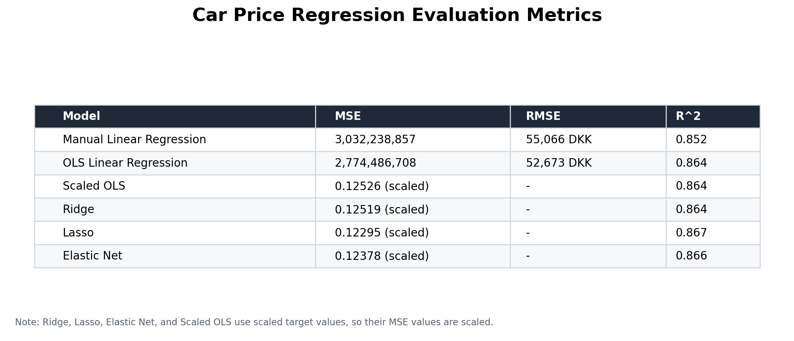
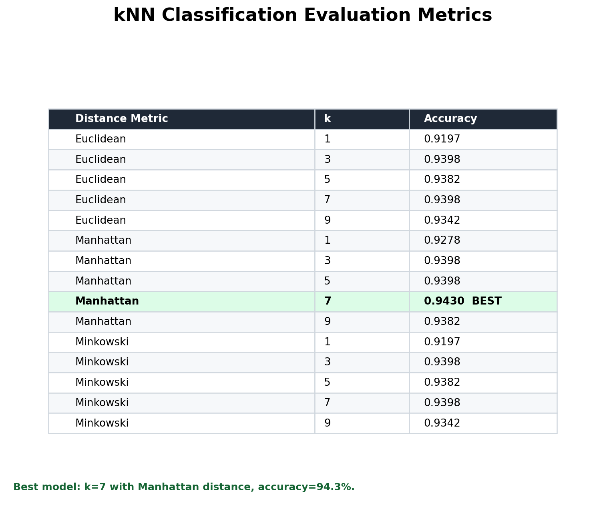

# Electric Vehicle Price Prediction And Classification

## Machine Learning Model Report For Portfolio And Exam Defense

This document summarizes a supervised machine learning project using electric vehicle listing data. The project includes regression models for predicting car prices and a kNN classifier for labeling cars as Cheap or Expensive.

## 1. Assignment Overview

This assignment uses a cleaned dataset of electric vehicle listings. Each row represents one car, and each column describes either the car's price or one of its technical/commercial characteristics.

The main target variable is:

```text
Price (DKK)
```

The first part of the assignment is a **supervised regression problem** because the dataset contains known target values, and the goal is to predict a continuous numerical value: the car price.

Later, the task is converted into a **supervised classification problem** by creating a new target:

```text
Cheap or Expensive
```

This is done by comparing each car price to the median price.

Key distinction:

- **Supervised learning**: the model learns from input features `X` and known answers `y`.
- **Unsupervised learning**: there is no target answer; the model tries to find patterns by itself.
- **Regression**: predicts a number.
- **Classification**: predicts a class/category.

## 2. Data Loading And Preparation

The dataset is loaded from the Excel file using pandas:

```python
car_data = pd.read_excel("car_prices.xlsx")
```

The target column is:

```python
target_column = "Price (DKK)"
```

The data is then separated into:

```text
X = features/input variables
y = target/output variable
```

The feature table is created by removing the target column:

```python
features_table = car_data.drop(columns=[target_column])
price_values = car_data[target_column]
```

This is important because the model should not receive the answer as an input. If `Price (DKK)` stayed inside `X`, the model would leak the target and effectively cheat.

Feature names are saved:

```python
feature_names = features_table.columns.tolist()
```

This is useful later when interpreting coefficients and finding important features.

The data is converted to NumPy arrays:

```python
X = features_table.values
y = price_values.values
```

Scikit-Learn models work naturally with numerical arrays.

## 3. Train-Test Split

The dataset is split into training and test data:

```python
X_train, X_test, y_train, y_test = train_test_split(
    X,
    y,
    test_size=0.2,
    random_state=42
)
```

Meaning:

- `X_train`, `y_train`: used to train the model.
- `X_test`, `y_test`: used to evaluate the model on unseen data.
- `test_size=0.2`: 20% test data and 80% training data.
- `random_state=42`: makes the split reproducible.

The split produced:

```text
Training features: (4980, 15)
Training target:   (4980,)
Test features:     (1246, 15)
Test target:       (1246,)
```

## 4. Manual Linear Regression With Linear Algebra

The first regression model is implemented manually using the normal equation:

```text
B = (X^T X)^-1 X^T y
```

Where:

- `X` is the design matrix.
- `y` is the target vector.
- `B` is the coefficient vector.
- `X^T` means transpose of `X`.

The model form is:

```text
Price = intercept + coefficient1 * feature1 + coefficient2 * feature2 + ...
```

### Intercept Column

A column of ones is added to the feature matrix:

```python
X_train_i = np.hstack((np.ones((X_train.shape[0], 1)), X_train))
X_test_i  = np.hstack((np.ones((X_test.shape[0], 1)),  X_test))
```

This is needed so the linear algebra formula can include the intercept term.

### Coefficient Calculation

The code calculates:

```python
XtX = X_train_i.T @ X_train_i
Xty = X_train_i.T @ y_train
B = np.linalg.pinv(XtX) @ Xty
```

Important syntax:

- `.T`: matrix transpose.
- `@`: matrix multiplication.
- `np.linalg.pinv`: pseudo-inverse.

The pseudo-inverse is used instead of the normal inverse because it is more stable if the matrix is singular or nearly singular, for example when features are correlated.

### Prediction

Predictions are calculated manually:

```python
y_pred = X_test_i @ B
```

This is the manual equivalent of:

```python
model.predict(X_test)
```

### Manual Model Results

The manual linear regression model produced approximately:

```text
MSE:  3,032,238,857
RMSE: 55,066 DKK
R^2:  0.852
```

Interpretation:

- The model explains about 85.2% of the variation in car prices.
- The typical prediction error is around 55,066 DKK.

## 5. Correlation Matrix And Heatmap

A correlation matrix is calculated:

```python
corr = car_data.corr(numeric_only=True)
```

Correlation measures the linear relationship between two variables.

Values:

- Close to `1`: strong positive relationship.
- Close to `-1`: strong negative relationship.
- Close to `0`: weak linear relationship.

The matrix is visualized as a heatmap using Matplotlib.

Important observations:

- `Original Price (DKK)` has a strong positive correlation with `Price (DKK)`.
- `Mileage (km)` has a negative relationship with price.
- Performance-related features such as horsepower, top speed, battery capacity, and electric range also relate to price.

Correlation is useful for data understanding, but it does not prove causation.

## 6. OLS Linear Regression With Scikit-Learn

Ordinary Least Squares regression is implemented using:

```python
model = LinearRegression()
model.fit(X_train, y_train)
y_pred = model.predict(X_test)
```

Definitions:

- `LinearRegression()`: creates the model.
- `.fit(X_train, y_train)`: trains the model by learning coefficients.
- `.predict(X_test)`: predicts prices for unseen test cars.

OLS tries to find the coefficients that minimize the squared prediction errors.

### OLS Results

The Scikit-Learn OLS model produced approximately:

```text
MSE:  2,774,486,708
RMSE: 52,673 DKK
R^2:  0.864
```

Interpretation:

- The model explains about 86.4% of the variation in car prices.
- The average prediction error is around 52,673 DKK.
- The library implementation performs slightly better than the manual implementation.

## 7. Scaling

Before using Ridge, Lasso, Elastic Net, and kNN, the data is scaled using `StandardScaler`.

```python
scaler_X = StandardScaler()
X_train_scaled = scaler_X.fit_transform(X_train)
X_test_scaled  = scaler_X.transform(X_test)
```

For the target:

```python
scaler_y = StandardScaler()
y_train_scaled = scaler_y.fit_transform(np.asarray(y_train).reshape(-1, 1)).ravel()
y_test_scaled  = scaler_y.transform(np.asarray(y_test).reshape(-1, 1)).ravel()
```

### Important Definitions

`StandardScaler`:

Transforms values so they have mean `0` and standard deviation `1`.

`fit`:

Learns values from the training data, such as mean and standard deviation.

`transform`:

Applies the learned transformation.

`fit_transform`:

Fits and transforms in one step.

Important rule:

Fit the scaler only on the training data, then transform the test data. This avoids data leakage.

### Why Scaling Is Needed

Scaling is needed because features have different ranges:

- Mileage can be very large.
- Number of doors is small.
- Model year is around 2024.
- Original price is a large DKK value.

Regularized models depend on coefficient size, so scaling makes the penalty fair.

kNN is distance-based, so scaling prevents large-value features from dominating the distance.

## 8. Ridge Regression

Ridge regression is linear regression with **L2 regularization**.

It adds a penalty for large coefficients.

Effect:

- Shrinks coefficients.
- Reduces overfitting.
- Usually keeps all features in the model.

Hyperparameter:

```python
alpha
```

Alpha controls regularization strength:

- Small alpha: weak penalty.
- Large alpha: strong penalty.

Tested alphas:

```python
[0.001, 0.01, 0.1, 1.0, 10.0, 100.0]
```

Best Ridge result:

```text
Best alpha: 0.001
Scaled MSE: 0.12519
R^2: 0.86443
```

## 9. Lasso Regression

Lasso regression is linear regression with **L1 regularization**.

It can shrink some coefficients exactly to zero.

Effect:

- Reduces overfitting.
- Can perform feature selection.
- Removes weak or less useful features.

Hyperparameters:

- `alpha`: regularization strength.
- `max_iter=100000`: increases the maximum iterations to help the model converge.

Best Lasso result:

```text
Best alpha: 0.01
Scaled MSE: 0.12295
R^2: 0.86685
```

Lasso performed best among the regularized regression models in this notebook.

## 10. Elastic Net

Elastic Net combines Ridge and Lasso.

It uses both:

- L1 regularization from Lasso.
- L2 regularization from Ridge.

Hyperparameters:

- `alpha`: total regularization strength.
- `l1_ratio=0.5`: balance between Lasso and Ridge.
- `max_iter=100000`: helps convergence.

Best Elastic Net result:

```text
Best alpha: 0.01
Scaled MSE: 0.12378
R^2: 0.86595
```

Elastic Net performed close to Lasso and Ridge.

## 11. Scaled OLS

OLS is also rebuilt using scaled data:

```python
ols_scaled = LinearRegression()
ols_scaled.fit(X_train_scaled, y_train_scaled)
pred_ols = ols_scaled.predict(X_test_scaled)
```

Purpose:

To compare the coefficients with Ridge and Lasso on a scaled feature space.

When features are scaled, coefficients are easier to compare because the features are on the same scale.

Scaled OLS result:

```text
Scaled MSE: 0.12526
R^2: 0.86435
```

Note:

In the notebook output, the scaled OLS feature importance shows extremely large drivetrain coefficients. This is caused by redundancy among drivetrain dummy columns:

```text
Rear-Wheel Drive + All-Wheel Drive + Front-Wheel Drive = 1
```

With an intercept, this can cause unstable OLS coefficients. Ridge and Lasso handle this more safely because of regularization.

## 12. Feature Importance

Feature importance is estimated by sorting coefficients by absolute value:

```python
pairs = sorted(zip(feature_names, coefs), key=lambda x: abs(x[1]), reverse=True)
```

For scaled models, larger absolute coefficients indicate stronger influence on the prediction.

Important features from Ridge and Lasso include:

- `Original Price (DKK)`
- `Model Year`
- `Mileage (km)`
- `Electric Range (km)`
- `Annual Road Tax (DKK)` or acceleration depending on the model

Interpretation:

- Positive coefficient: feature increases predicted price.
- Negative coefficient: feature decreases predicted price.

Example:

- Higher original price generally increases current price.
- Higher mileage generally decreases current price.

## 13. Classification Target For kNN

The final task converts the problem from regression to classification.

The median price is calculated:

```python
median_price = df["Price (DKK)"].median()
```

Result:

```text
Median price: 304,900 DKK
```

A new binary target is created:

```python
df["Price_Class"] = np.where(df["Price (DKK)"] > median_price, 1, 0)
```

Meaning:

- `1`: Expensive, if price is above the median.
- `0`: Cheap, if price is at or below the median.

Class distribution:

```text
Cheap:     3123
Expensive: 3103
```

The classes are almost balanced, which is good for accuracy.

## 14. kNN Data Preparation

For classification:

```python
X_class = df.drop(columns=["Price (DKK)", "Price_Class"])
y_class = df["Price_Class"]
```

Then the data is split:

```python
X_train_c, X_test_c, y_train_c, y_test_c = train_test_split(
    X_class, y_class, test_size=0.2, random_state=42
)
```

The features are scaled:

```python
scaler = StandardScaler()
X_train_c_scaled = scaler.fit_transform(X_train_c)
X_test_c_scaled  = scaler.transform(X_test_c)
```

Scaling is essential for kNN because kNN uses distances between data points.

## 15. kNN Classifier

kNN means **k-Nearest Neighbors**.

How it works:

1. A new car is given to the model.
2. The model finds the `k` most similar cars in the training set.
3. Those neighbors vote.
4. The majority class becomes the prediction.

Example:

If `k=7`, the model looks at the 7 nearest cars.

Hyperparameters tested:

```python
k_values = [1, 3, 5, 7, 9]
metrics = ["euclidean", "manhattan", "minkowski"]
```

Important definitions:

- `k`: number of neighbors used for voting.
- `metric`: distance method used to measure similarity.
- Small `k`: can overfit and be sensitive to noise.
- Large `k`: can underfit and oversmooth patterns.

Distance metrics:

- Euclidean: straight-line distance.
- Manhattan: city-block distance; sums absolute differences.
- Minkowski: generalized distance metric; with default settings it behaves like Euclidean.

Best kNN result:

```text
Best k: 7
Best metric: Manhattan
Best accuracy: 0.943
```

Interpretation:

The model correctly classified about 94.3% of test cars as Cheap or Expensive.

## 16. Evaluation Metrics

The following figures summarize the main model evaluation results from the notebook.





### MSE

Mean Squared Error.

Measures average squared difference between actual and predicted values.

Lower is better.

Because price is measured in DKK, MSE becomes very large because errors are squared.

### RMSE

Root Mean Squared Error.

Square root of MSE.

Easier to understand because it is in the same unit as the target.

Example:

```text
RMSE = 52,673 DKK
```

Means:

```text
The model is typically wrong by about 52,673 DKK.
```

### R^2

Coefficient of determination.

Measures how much variation in the target is explained by the model.

Example:

```text
R^2 = 0.864
```

Means:

```text
The model explains about 86.4% of the variation in car prices.
```

R^2 is not accuracy.

### Accuracy

Used for classification.

Measures the percentage of correct predictions.

Example:

```text
Accuracy = 0.943
```

Means:

```text
94.3% of test cars were classified correctly.
```

## 17. Important Exam Defense Points

### Why Is This Supervised Learning?

Because the dataset contains known answers:

- Price for regression.
- Cheap/Expensive label for classification.

### Why Is The First Part Regression?

Because the model predicts a continuous numerical value: car price.

### Why Is The Final Part Classification?

Because the model predicts a category: Cheap or Expensive.

### Why Use Train-Test Split?

To train the model on one part of the data and test it on unseen data. This evaluates generalization.

### Why Use Scaling?

Because models like Ridge, Lasso, Elastic Net, and kNN are sensitive to feature scales.

### Why Use Regularization?

To reduce overfitting and control coefficient size.

### Why Use Multiple Alpha Values?

Because alpha is a hyperparameter, and testing several values helps find the best regularization strength.

### Why Use kNN?

Because it is a simple classification model that predicts a class based on similar examples.

## 18. Final Exam Summary

This assignment demonstrates a full supervised machine learning workflow.

First, the EV car dataset was loaded and split into features and target. The target was `Price (DKK)`, so the first task was regression. The data was split into training and test sets to evaluate generalization.

Then linear regression was implemented manually using the normal equation to understand the linear algebra behind the model. The manual model achieved an `R^2` of about 0.85 and an RMSE of about 55,000 DKK.

Next, OLS regression was implemented with Scikit-Learn and achieved slightly better performance, with an `R^2` of about 0.864 and RMSE around 52,673 DKK.

After that, Ridge, Lasso, and Elastic Net were trained on scaled data. Scaling was necessary because regularization depends on coefficient size. Lasso performed best with alpha `0.01`, scaled MSE `0.12295`, and `R^2` `0.86685`.

Finally, the assignment was converted into a classification task by labeling cars as Cheap or Expensive based on the median price. A kNN classifier was trained using different `k` values and distance metrics. The best model used `k=7` and Manhattan distance, achieving 94.3% accuracy.

The most important ideas to defend are:

- how `X` and `y` were prepared,
- why the task is supervised,
- why regression and classification use different metrics,
- why scaling is needed,
- how regularization works,
- and how kNN classifies based on nearest neighbors.
