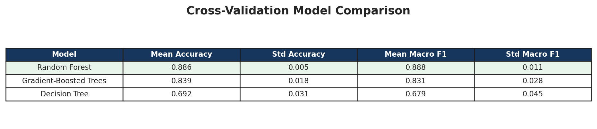
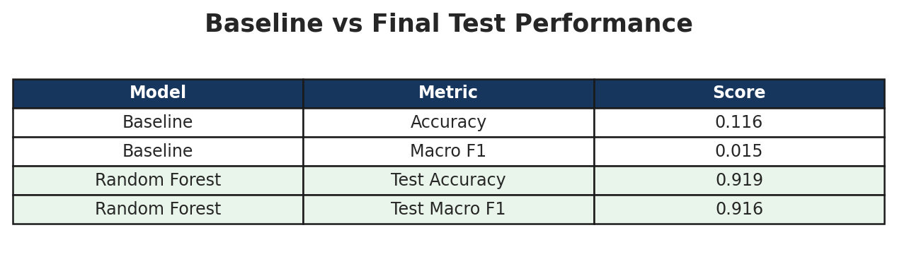
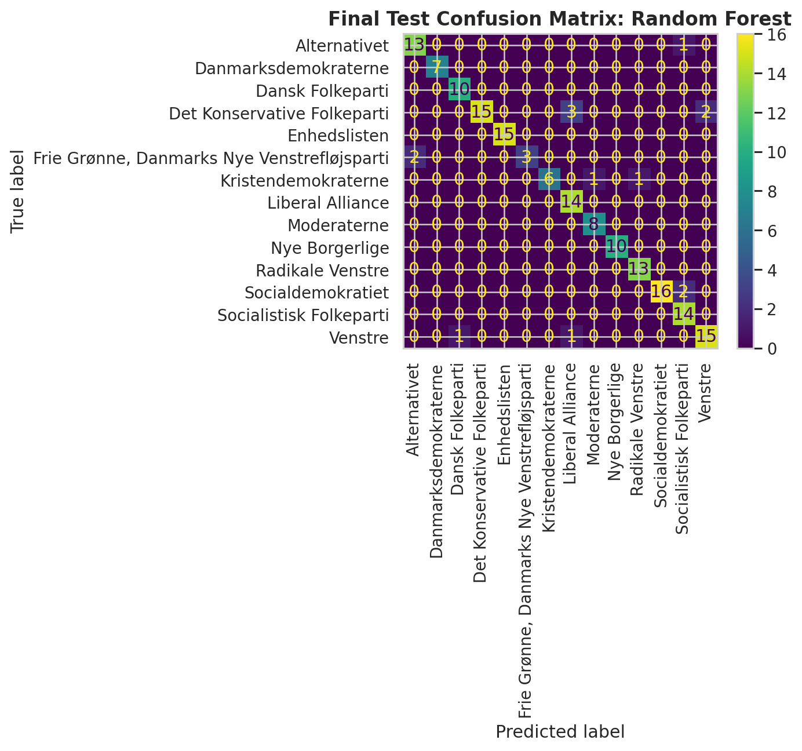

# Candidate Test 2022: Supervised Machine Learning Classification

## Portfolio Summary

This project demonstrates an end-to-end supervised machine learning workflow using real Danish election candidate-test data from DR and TV2. The work includes data inspection, preprocessing, descriptive analysis, feature engineering, model training, cross-validation, final test evaluation, and interpretation of model outputs.

The goal was to predict a candidate's political party from questionnaire answer patterns using tree-based classification models.

## 1. Assignment Overview

This assignment analyzes Danish candidate-test data from DR and TV2.

The data contains political candidates and their answers to questionnaire questions. The answers are numeric values from `-2` to `2`:

- `-2`: strongly disagree
- `-1`: disagree
- `0`: neutral
- `1`: agree
- `2`: strongly agree

The assignment has two main parts:

1. Descriptive analysis:
   - age distribution by party
   - confidence score by party
   - party differences and candidate answer behavior

2. Machine learning classification:
   - use the candidate answer columns as features
   - predict the candidate's party
   - compare Decision Tree, Random Forest, and Gradient-Boosted Trees

This is **supervised multiclass classification**.

It is supervised because the true party labels are known during training.

It is classification because the target is a category: party affiliation.

It is multiclass because there are more than two possible parties.

## 2. Main Data

The notebook loads six Excel files:

- `alldata.xlsx`: all candidate responses from DR and TV2
- `drdata.xlsx`: DR candidate responses
- `tv2data.xlsx`: TV2 candidate responses
- `drq.xlsx`: DR questions
- `tv2q.xlsx`: TV2 questions
- `electeddata.xlsx`: elected candidates

The main dataset used for modelling is `all_data`, because it contains responses from both DR and TV2.

Each row represents one candidate.

Important columns:

- `navn`: candidate name
- `parti`: candidate party
- `storkreds`: electoral district
- `alder`: age
- all other columns: questionnaire answer features

## 3. Initial Data Inspection

The notebook uses:

```python
all_data.info()
```

This checks:

- number of rows
- number of columns
- column names
- data types
- missing values

The notebook also uses:

```python
all_data.describe(include="all").T
```

This gives summary statistics for each column.

For numerical columns, it shows values such as:

- count
- mean
- standard deviation
- min
- max

For categorical columns, it shows:

- number of unique values
- most frequent value
- frequency of most frequent value

## 4. Data Cleaning And Feature Definition

The notebook treats age `0` as missing:

```python
data["alder"] = data["alder"].replace(0, np.nan)
```

This is done because age `0` is not realistic for a political candidate.

This matters mainly for the descriptive age analysis.

The notebook then separates metadata columns from feature columns:

```python
candidate_info_cols = ["navn", "parti", "storkreds", "alder"]
feature_cols = [col for col in all_data.columns if col not in candidate_info_cols]
```

`feature_cols` contains the questionnaire answer columns.

These columns are used as the machine learning input features.

Exam sentence:

> I use the political answer columns as features and party affiliation as the target.

## 5. Response Value Check

The notebook checks the minimum, maximum, and unique answer values:

```python
response_min = all_data[feature_cols].min().min()
response_max = all_data[feature_cols].max().max()
unique_values = sorted(pd.unique(all_data[feature_cols].values.ravel()))
```

This confirms that the answers follow the expected scale from `-2` to `2`.

This is important because the models assume the feature columns contain valid numeric questionnaire answers.

## 6. Party Distribution

The notebook counts candidates per party:

```python
party_counts = all_data["parti"].value_counts()
```

This shows that the dataset is imbalanced.

Some parties have many candidates, while others have fewer.

Why this matters:

- accuracy alone can be misleading
- a model could perform well on large parties but badly on small parties
- macro F1 is therefore used later

## 7. Age Analysis

The notebook groups age by party:

```python
age_summary = (
    all_data.groupby("parti")["alder"]
    .agg(["count", "mean", "median", "min", "max"])
    .sort_values("mean")
)
```

Definitions:

- `count`: number of candidates with valid age
- `mean`: average age
- `median`: middle age when values are sorted
- `min`: youngest candidate age
- `max`: oldest candidate age

Mean vs median:

- mean is affected by extreme values
- median is more robust against outliers

The notebook also uses a box plot for age distribution.

Box plot explanation:

- line inside the box: median
- box: middle 50% of values
- whiskers: normal range
- empty circles: outliers

## 8. Confidence Score

The notebook defines confidence as the proportion of strong answers:

```python
all_data["confidence_score"] = (all_data[feature_cols].abs() == 2).mean(axis=1)
```

This means:

- answer `-2` counts as strongly disagree
- answer `2` counts as strongly agree
- both are considered strong answers

Examples:

- confidence score `0.0`: no strong answers
- confidence score `0.5`: half the answers are strong
- confidence score `1.0`: all answers are strong

This is descriptive analysis only.

The confidence score is not used as an extra model feature.

The model uses the original questionnaire answer columns.

## 9. Machine Learning Setup

The notebook removes independent candidates:

```python
final_data = all_data[all_data["parti"] != "Løsgænger"].copy()
```

Reason:

`Løsgænger` has only a few candidates, which makes classification and stratified splitting unstable.

The notebook defines:

```python
X = final_data[feature_cols]
y = final_data["parti"]
```

`X` contains the input features: questionnaire answers.

`y` contains the target label: party.

Exam sentence:

> X contains all answer columns, and y contains the party. The model learns to predict party based on answer patterns.

## 10. Label Encoding

The target labels are party names, which are text.

The notebook converts them to numeric labels:

```python
label_encoder = LabelEncoder()
y_encoded = label_encoder.fit_transform(y)
```

Definitions:

- `fit`: learns the mapping from party names to numbers
- `transform`: applies the mapping
- `fit_transform`: learns and applies in one step

Important:

The numbers do not have political meaning.

They are only class IDs for the model.

Example:

```text
Alternativet -> 0
Venstre -> 13
```

The exact numbers are not important.

## 11. Train/Test Split

The notebook splits data into training and test sets:

```python
X_train, X_test, y_train, y_test = train_test_split(
    X,
    y_encoded,
    test_size=0.2,
    stratify=y_encoded,
    random_state=42,
)
```

Meaning:

- 80% training data
- 20% test data
- training data is used to train and compare models
- test data is kept unseen until final evaluation

Important parameters:

- `test_size=0.2`: 20% of data becomes test data
- `stratify=y_encoded`: preserves party proportions in train and test sets
- `random_state=42`: makes the split reproducible

Why stratification matters:

The party classes are imbalanced, so stratification helps ensure smaller parties are represented in both train and test sets.

## 12. Baseline Model

The notebook uses:

```python
baseline = DummyClassifier(strategy="most_frequent")
baseline.fit(X_train, y_train)
baseline_pred = baseline.predict(X_test)
```

The baseline model always predicts the most common party in the training data.

It does not learn from questionnaire answers.

Why use it:

The baseline gives a minimum comparison point.

The real models should perform clearly better than this.

Exam sentence:

> If my real models do not beat the baseline, they are not learning useful answer patterns.

## 13. Model 1: Decision Tree

Definition:

A Decision Tree predicts by asking a sequence of questions about the features.

Example:

```text
Is answer 11b <= -0.5?
```

If true, go left.

If false, go right.

At the end, the model predicts the majority class in the final leaf.

Hyperparameters used:

```python
DecisionTreeClassifier(
    max_depth=6,
    min_samples_leaf=5,
    random_state=42,
)
```

Meaning:

- `max_depth=6`: tree can grow at most 6 levels deep
- `min_samples_leaf=5`: every final leaf must contain at least 5 candidates
- `random_state=42`: reproducible result

Why chosen:

These settings reduce overfitting.

A very deep tree can memorize the training data.

Strength:

- easy to explain
- can visualize the splits

Weakness:

- can overfit
- less stable than ensemble methods

## 14. Model 2: Random Forest

Definition:

A Random Forest is an ensemble of many Decision Trees.

Each tree makes a prediction, and the forest combines their votes.

For classification:

```text
many trees vote -> majority party becomes final prediction
```

Hyperparameters used:

```python
RandomForestClassifier(
    n_estimators=100,
    min_samples_leaf=2,
    random_state=42,
    n_jobs=1,
)
```

Meaning:

- `n_estimators=100`: build 100 trees
- `min_samples_leaf=2`: each leaf needs at least 2 samples
- `random_state=42`: reproducible
- `n_jobs=1`: use one CPU core

Why chosen:

Random Forest usually generalizes better than one Decision Tree because combining many trees reduces variance and overfitting.

Strength:

- strong performance
- more stable than a single tree
- gives feature importance

Weakness:

- less interpretable than one tree

## 15. Model 3: Gradient-Boosted Trees

Definition:

Gradient-Boosted Trees also combine many trees, but they are built sequentially.

Each new tree tries to correct mistakes made by the previous trees.

Hyperparameters used:

```python
GradientBoostingClassifier(
    max_depth=3,
    learning_rate=0.05,
    n_estimators=80,
    random_state=42,
)
```

Meaning:

- `max_depth=3`: each tree is shallow
- `learning_rate=0.05`: each tree contributes slowly
- `n_estimators=80`: build 80 trees
- `random_state=42`: reproducible

Why chosen:

Boosting often works well with many small trees.

The low learning rate helps reduce overfitting.

Strength:

- can be very accurate
- improves step by step

Weakness:

- more sensitive to hyperparameters
- can overfit if too aggressive

## 16. Cross-Validation

The notebook uses:

```python
cross_val = StratifiedKFold(n_splits=3, shuffle=True, random_state=42)
```

Cross-validation means the model is trained and validated multiple times on different splits of the training data.

Here, 3-fold cross-validation means:

1. train on two folds, validate on one fold
2. repeat until every fold has been validation once
3. average the scores

`StratifiedKFold` keeps party proportions similar in each fold.

Why use cross-validation:

- gives a more stable estimate than one validation split
- uses the training data more effectively
- keeps the final test set untouched

## 17. Evaluation Metrics

The notebook uses:

```python
scoring = {
    "accuracy": "accuracy",
    "macro_f1": "f1_macro",
}
```

### Accuracy

Accuracy is the percentage of correct predictions.

Formula:

```text
correct predictions / all predictions
```

Example:

If 90 out of 100 candidates are predicted correctly, accuracy is `0.90`.

Weakness:

Accuracy can be misleading when classes are imbalanced.

### Macro F1

F1 combines precision and recall.

Macro F1 calculates F1 for each party separately and then averages them equally.

Why macro F1 matters:

The dataset is imbalanced.

Macro F1 gives smaller parties equal importance.

Exam sentence:

> I use accuracy for overall correctness and macro F1 because the parties are imbalanced.

### Evaluation Screenshots

The figures below summarize the main model evaluation results from the notebook.







## 18. Precision, Recall, And F1

These appear in the classification report.

### Precision

Of all candidates predicted as a party, how many were actually that party?

Example:

> Of all candidates predicted as Alternativet, how many were truly Alternativet?

### Recall

Of all real candidates from a party, how many did the model find?

Example:

> Of all true Alternativet candidates, how many were predicted as Alternativet?

### F1-score

F1 is the balance between precision and recall.

It is useful when both false positives and false negatives matter.

### Support

Support is the number of true samples for each class in the test set.

## 19. Model Comparison

The notebook compares all three models using cross-validation:

```python
for name, model in models.items():
    scores = cross_validate(model, X_train, y_train, cv=cross_val, scoring=scoring)
```

The results are stored in a table with:

- model name
- mean accuracy
- standard deviation of accuracy
- mean macro F1
- standard deviation of macro F1

Standard deviation means how much the score changes across folds.

Low standard deviation means the model is stable.

Result interpretation:

- Random Forest performed best
- Gradient-Boosted Trees was second
- Decision Tree performed worst

Why Random Forest likely performed best:

It combines many decision trees, which reduces the overfitting problem of a single tree.

## 20. Final Model

The notebook selects the best model:

```python
best_model_name = cv_results_df.loc[0, "model"]
final_model = clone(models[best_model_name])
```

The table is sorted by `mean_macro_f1`, so row `0` is the best model.

In this notebook, the best model is Random Forest.

Then the model is trained on the full training set:

```python
final_model.fit(X_train, y_train)
```

Then it predicts the test set:

```python
y_test_pred = final_model.predict(X_test)
```

Important:

The test set is used only at the end.

This gives a fair estimate of how the model performs on unseen candidates.

## 21. Confusion Matrix

The notebook displays a confusion matrix:

```python
ConfusionMatrixDisplay.from_predictions(
    y_test,
    y_test_pred,
    display_labels=label_encoder.classes_,
    xticks_rotation=90,
)
```

Definition:

A confusion matrix shows correct and incorrect predictions.

How to read it:

- rows: true party
- columns: predicted party
- diagonal: correct predictions
- off-diagonal: mistakes

Example:

If Alternativet has `13` on the diagonal, that means 13 true Alternativet candidates were correctly predicted as Alternativet.

If one Alternativet candidate is predicted as Socialistisk Folkeparti, that is:

- false negative for Alternativet
- false positive for Socialistisk Folkeparti

Exam sentence:

> Most values are on the diagonal, so the model performs well. The off-diagonal values show which parties are confused.

## 22. Feature Importance

Both Decision Tree and Random Forest can produce feature importance.

Feature importance shows which questionnaire answer columns helped the model most when splitting the data.

Important:

Feature importance does not mean causation.

It only means the feature was useful for this model's predictions.

Exam sentence:

> Feature importance shows which questions helped the model separate parties, but it should not be treated as political proof.

## 23. Candidate Signals

The last code cell uses cross-validation predictions:

```python
rf_cv_pred = cross_val_predict(
    clone(models["Random Forest"]),
    X,
    y_encoded,
    cv=cross_val,
    method="predict",
)
```

This predicts each candidate's party using cross-validation.

The notebook also gets probabilities:

```python
rf_cv_proba = cross_val_predict(
    clone(models["Random Forest"]),
    X,
    y_encoded,
    cv=cross_val,
    method="predict_proba",
)
```

`predict_proba` gives the probability assigned to each party.

The notebook creates:

```python
candidate_signals["correct"] = candidate_signals["parti"] == candidate_signals["predicted_party"]
```

This checks whether the predicted party matches the true party.

Then it filters:

```python
candidate_signals[candidate_signals["correct"] == False]
```

This means:

> show only candidates where the prediction was wrong.

Then it sorts by:

```python
"true_party_probability"
```

This shows candidates where the model gave low probability to their real party.

Interpretation:

These candidates were predicted as another party by the Random Forest.

This does not prove they are in the wrong party.

It only means their answer pattern looked more similar to another party according to the model.

## 24. Important Technical Terms

### Feature

An input variable used by the model.

Here, features are questionnaire answer columns.

### Target

The value the model tries to predict.

Here, the target is party affiliation.

### Hyperparameter

A setting chosen before training the model.

Examples:

- `max_depth`
- `n_estimators`
- `learning_rate`
- `min_samples_leaf`

### Fit

Training or learning from data.

Example:

```python
model.fit(X_train, y_train)
```

### Predict

Using a trained model to make predictions.

Example:

```python
model.predict(X_test)
```

### Transform

Applying a learned conversion.

Example:

LabelEncoder transforms party names into numbers.

### Fit Transform

Learning and applying a conversion in one step.

### Scaler

A scaler changes numerical feature values to a common scale.

Examples:

- standard scaling
- min-max scaling

This notebook does not use a scaler because tree-based models usually do not require scaling.

Decision Trees, Random Forests, and Gradient-Boosted Trees split based on feature thresholds, so scaling is not as important as it is for models like kNN, logistic regression, or SVM.

### Alpha

`alpha` is often a regularization strength parameter in models such as Ridge, Lasso, or Elastic Net.

This notebook does not use `alpha`.

### LBFGS

`lbfgs` is an optimization algorithm often used in Logistic Regression or Neural Networks.

This notebook does not use `lbfgs`.

## 25. Strong Exam Summary

Use this as your final oral summary:

> This assignment combines descriptive analysis and supervised multiclass classification. I was given Danish candidate-test answers from DR and TV2, where candidates answered political questions on a scale from -2 to 2. First, I analyzed party distribution, age, and confidence scores. Then I used the questionnaire answers as features and party affiliation as the target. Since the true party labels are known, this is supervised classification. I compared Decision Tree, Random Forest, and Gradient-Boosted Trees using stratified cross-validation with accuracy and macro F1. Random Forest performed best, which makes sense because it combines many trees and reduces overfitting compared with a single Decision Tree. Finally, I evaluated the best model on the held-out test set and used the confusion matrix to see which parties were predicted correctly or confused. The results show that candidate answers can predict party affiliation quite well, but the model should be interpreted carefully because self-reported answers do not fully represent real political ideology.

## 26. Short 6-Minute Presentation Flow

1. Introduce the assignment:
   - candidate-test data from DR and TV2
   - answers from `-2` to `2`
   - goal: descriptive analysis and party prediction
   - supervised multiclass classification

2. Explain preprocessing:
   - age `0` treated as missing
   - answer columns selected as features
   - party selected as target
   - `Løsgænger` removed because class is too small
   - labels encoded to numbers

3. Explain descriptive analysis:
   - party counts show imbalance
   - age box plots show age distribution and outliers
   - confidence score shows proportion of strong answers

4. Explain model setup:
   - train/test split
   - stratification
   - baseline model
   - Decision Tree, Random Forest, Gradient-Boosted Trees

5. Explain evaluation:
   - accuracy
   - macro F1
   - cross-validation
   - confusion matrix

6. Conclude:
   - Random Forest best
   - results are useful but not absolute political truth
