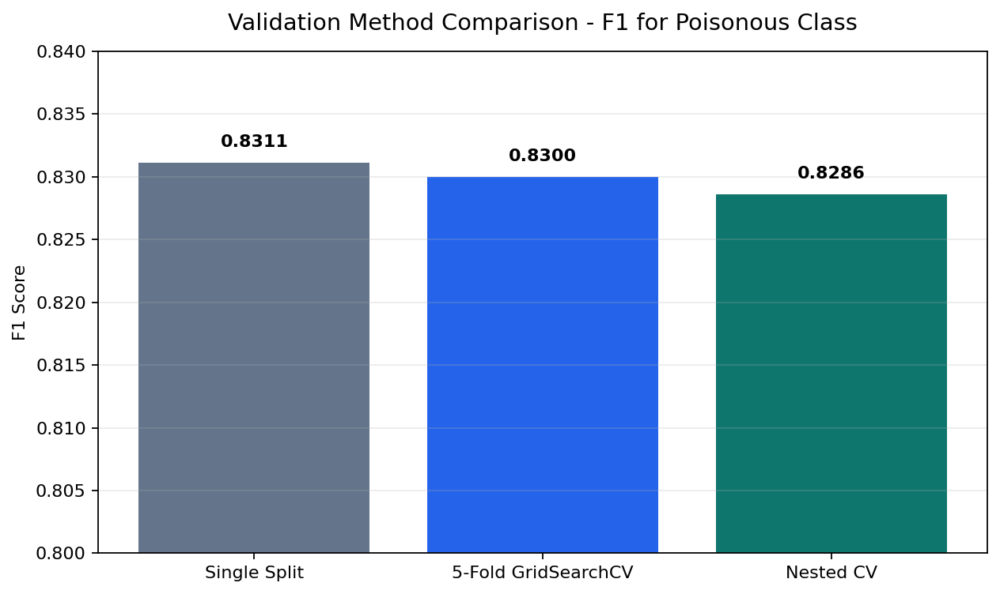
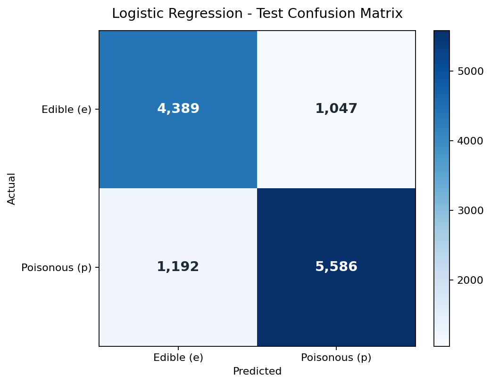
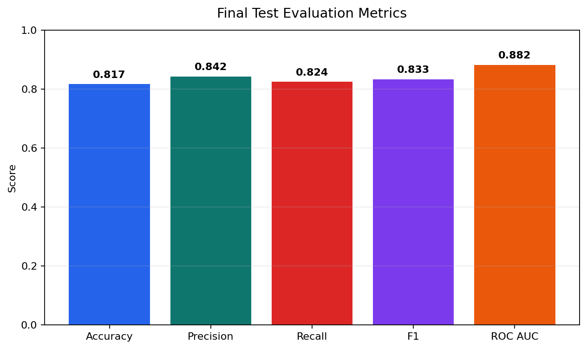

# Mushroom Toxicity Classification Using Logistic Regression

## Portfolio Project Summary

This project demonstrates an end-to-end supervised machine learning workflow for binary classification. The objective was to classify mushrooms as edible or poisonous using structured tabular data, with a strong focus on preprocessing, validation strategy, model evaluation, and safety-aware interpretation.

Key skills demonstrated:

- data inspection and preprocessing
- missing-value handling
- train/validation/test splitting
- leakage-aware machine learning pipelines
- logistic regression classification
- hyperparameter tuning with cross-validation
- model evaluation using confusion matrix, precision, recall, F1 score, ROC AUC, and precision-recall analysis
- risk-based model interpretation for a safety-sensitive classification problem

## 1. Problem Overview

The assignment uses a mushroom dataset with approximately 61,000 observations. Each row describes a mushroom using features such as cap diameter, cap shape, cap color, gill properties, stem measurements, habitat, and season.

The goal is to build a machine learning model that classifies each mushroom as:

- `e`: edible
- `p`: poisonous

This is a **supervised machine learning classification problem** because the dataset already contains the correct class labels. The model learns from labelled examples and predicts one of two categories.

The assignment required:

- informed data preparation
- logistic regression
- three validation methodologies for hyperparameter tuning
- confusion matrices with comments
- ROC curve
- precision-recall curve
- accuracy, precision, recall, and F1 score
- a discussion of the most relevant performance metric

## 2. Data Inspection

The dataset contains:

- 61,069 rows
- 21 original columns
- target column: `class`

Class distribution:

| Class | Count | Meaning |
|---|---:|---|
| `p` | 33,888 | poisonous |
| `e` | 27,181 | edible |

The target distribution is slightly imbalanced:

- poisonous: about 55.5%
- edible: about 44.5%

The dataset also contains 146 duplicate rows. These were checked and noted. Because the number is very small compared with the full dataset size, duplicates are unlikely to strongly affect the result, but they remain a possible limitation.

## 3. Data Preparation

The target variable was separated from the input features:

- `X`: all feature columns
- `y`: the target column `class`

The data was split before fitting preprocessing steps. This is important because preprocessing decisions should be based on training data only, not on validation or test data.

The split was:

- training + validation: 80%
- final test set: 20%

Then the training + validation data was split again into:

- training set: 60% of the full dataset
- validation set: 20% of the full dataset
- test set: 20% of the full dataset

Stratified splitting was used so the edible/poisonous ratio stayed similar in all sets.

## 4. Missing Values And Column Selection

Missing values were inspected using the training data. Columns with very high missing-value ratios were considered for removal. The intended rule was to drop columns with more than 80% missing values, using the training data only.

The workflow is important because selecting columns before splitting could technically leak information from validation or test data.

After preparation, the working feature matrix contained:

- 3 numeric features
- 13 categorical features
- 16 total features

Numeric features:

- `cap-diameter`
- `stem-height`
- `stem-width`

Categorical features include columns such as:

- `cap-shape`
- `cap-surface`
- `cap-color`
- `gill-attachment`
- `gill-spacing`
- `gill-color`
- `stem-surface`
- `stem-color`
- `has-ring`
- `ring-type`
- `habitat`
- `season`

## 5. Preprocessing Pipeline

Different preprocessing was applied to numeric and categorical columns.

### Numeric Preprocessing

Numeric columns used:

1. **Median imputation**
   - Missing numeric values are replaced with the median value.
   - Median is robust because it is less affected by extreme values than the mean.

2. **StandardScaler**
   - Numeric values are scaled to have approximately mean 0 and standard deviation 1.
   - This helps logistic regression because numeric features are placed on a similar scale.

### Categorical Preprocessing

Categorical columns used:

1. **Most frequent imputation**
   - Missing categorical values are replaced with the most common category in that column.

2. **One-hot encoding**
   - Text/category values are converted into numeric 0/1 columns.
   - Logistic regression cannot directly use text labels, so encoding is required.

`handle_unknown="ignore"` was used in the encoder. This prevents errors if validation or test data contains a category that was not seen during training.

### Pipeline And ColumnTransformer

A `ColumnTransformer` was used to apply:

- numeric preprocessing to numeric columns
- categorical preprocessing to categorical columns

A full `Pipeline` combined:

1. preprocessing
2. logistic regression

This is good practice because it keeps preprocessing and model training together. During cross-validation, preprocessing is fitted only on the training fold, which helps avoid data leakage.

Important terms:

- **fit**: learn from training data, for example median values, scaling parameters, categories, or model coefficients.
- **transform**: apply the learned preprocessing to data.
- **fit_transform**: fit and transform the training data in one step.

## 6. Model

The required model was **Logistic Regression**.

Despite its name, logistic regression is used here for classification. It predicts the probability that a mushroom belongs to a class. In this notebook, the important positive class is:

- `p`: poisonous

Main model settings:

- `max_iter=1000`
  - allows the optimizer enough iterations to converge

- `solver="lbfgs"`
  - the optimization algorithm used to train logistic regression
  - a common and suitable solver for this type of model

- `C`
  - regularization hyperparameter
  - smaller `C` means stronger regularization
  - larger `C` means weaker regularization

Regularization helps reduce overfitting by discouraging overly large model coefficients.

## 7. Validation Methods

Three validation methods were used to tune and evaluate the model.

### Method 1: Single Validation Split

Different values of `C` were tested:

- `0.01`
- `0.1`
- `1`
- `10`

Each candidate model was trained on the training set and evaluated on the validation set.

Results:

| C | Accuracy | Precision p | Recall p | F1 p |
|---:|---:|---:|---:|---:|
| 0.10 | 0.8138 | 0.8370 | 0.8252 | 0.8311 |
| 1.00 | 0.8129 | 0.8372 | 0.8230 | 0.8300 |
| 10.00 | 0.8123 | 0.8368 | 0.8222 | 0.8294 |
| 0.01 | 0.8016 | 0.8192 | 0.8244 | 0.8218 |

Best value from the single validation split:

- `C = 0.1`

Pros:

- simple and fast
- easy to explain

Cons:

- depends on one split
- result may change if the split changes

### Method 2: Stratified K-Fold Cross-Validation With GridSearchCV

`GridSearchCV` was used to test the same `C` values with stratified 5-fold cross-validation.

Cross-validation means the data is split into folds. The model trains on some folds and validates on the remaining fold. This repeats so each fold is used for validation once.

Stratified cross-validation keeps the edible/poisonous ratio similar in each fold.

GridSearchCV tested the candidate `C` values and selected the best one using F1 score for the poisonous class.

Result:

- best parameter: `C = 0.1`
- best average cross-validation F1: approximately `0.8300`

This method was used to select the final model because it is more stable than a single validation split.

### Method 3: Nested Cross-Validation

Nested cross-validation uses two loops:

- inner loop: tunes hyperparameters
- outer loop: estimates performance

This gives a less optimistic estimate of model performance because hyperparameter tuning and performance estimation are separated.

Result:

- nested CV mean F1: approximately `0.8286`
- nested CV standard deviation: approximately `0.0025`

The nested CV result is close to the normal cross-validation result, which suggests the model performance is fairly stable.

### Validation Results Visualization

The validation scores are close across all three validation approaches. This supports the conclusion that the model is reasonably stable and that `C = 0.1` is a sensible hyperparameter choice.

## 8. Final Model

The final model used the best estimator from `GridSearchCV`.

The selected setting was:

- logistic regression with `C = 0.1`

The model was then fitted on `X_train_val` and `y_train_val`, meaning the combined training and validation data. The final evaluation was performed once on the untouched test set.

This is correct because the test set should only be used at the end to estimate final model performance.

## 9. Final Test Confusion Matrix

The final test confusion matrix was:

| Actual / Predicted | Edible `e` | Poisonous `p` |
|---|---:|---:|
| Edible `e` | 4,389 | 1,047 |
| Poisonous `p` | 1,192 | 5,586 |

Interpretation:

- 4,389 edible mushrooms were correctly predicted as edible.
- 1,047 edible mushrooms were incorrectly predicted as poisonous.
- 1,192 poisonous mushrooms were incorrectly predicted as edible.
- 5,586 poisonous mushrooms were correctly predicted as poisonous.

The most dangerous error is:

- actual poisonous, predicted edible

This is a **false negative**. In the test set, there were 1,192 false negatives.

### Confusion Matrix Visualization

The confusion matrix highlights the most important model risk: poisonous mushrooms predicted as edible. These 1,192 false negatives are the key reason recall is the most important metric for this project.

## 10. Final Test Metrics

Final test results:

| Metric | Value |
|---|---:|
| Accuracy | 0.8167 |
| Precision for poisonous | 0.8422 |
| Recall for poisonous | 0.8241 |
| F1 score for poisonous | 0.8330 |
| ROC AUC | 0.8816 |

### Final Metrics Visualization

The model achieves balanced performance across accuracy, precision, recall, and F1 score, with a strong ROC AUC. However, because the task is safety-sensitive, recall for the poisonous class is the most important metric to defend.

### Accuracy

Accuracy measures the proportion of all correct predictions.

The model achieved about 81.7% accuracy. This is a useful general summary, but it is not enough for this problem because false negatives are much more dangerous than false positives.

### Precision

Precision for poisonous answers:

> Of all mushrooms predicted as poisonous, how many were actually poisonous?

The model achieved about 84.2% precision for poisonous mushrooms.

### Recall

Recall for poisonous answers:

> Of all actually poisonous mushrooms, how many did the model correctly detect?

The model achieved about 82.4% recall. This means the model detected most poisonous mushrooms, but it still missed about 17.6%.

### F1 Score

F1 score balances precision and recall.

The model achieved an F1 score of about 83.3% for the poisonous class.

### ROC Curve And AUC

The ROC curve shows the trade-off between:

- true positive rate, also called recall
- false positive rate

It evaluates the model across different decision thresholds.

The ROC AUC was about 0.88. This means the model has good general ability to separate edible and poisonous mushrooms, but it is not perfect.

### Precision-Recall Curve

The precision-recall curve shows the trade-off between:

- precision
- recall

This is especially relevant because the poisonous class is the safety-critical class.

If the threshold is lowered, recall usually increases because more poisonous mushrooms are caught. However, precision may decrease because more edible mushrooms may be incorrectly predicted as poisonous.

## 11. Most Important Metric

The most important metric in this assignment is **recall for the poisonous class**.

Reason:

- a false positive means an edible mushroom is predicted as poisonous
- a false negative means a poisonous mushroom is predicted as edible

The false negative is much more dangerous because it could lead to someone eating a poisonous mushroom.

Therefore, the model should prioritize detecting poisonous mushrooms, even if that means sometimes classifying edible mushrooms as poisonous.

## 12. Limitations

The final model is useful for demonstrating machine learning workflow, but it should not be used for real mushroom foraging.

Main limitations:

- the model still produced 1,192 false negatives on the test set
- recall is not high enough for a safety-critical use case
- default probability threshold may not be optimal
- duplicate rows were checked but not removed
- only logistic regression was used because it was required by the assignment

## 13. Possible Improvements

To reduce false negatives, possible improvements include:

1. **Lower the decision threshold**
   - For example, classify as poisonous when probability is greater than 0.3 or 0.4 instead of 0.5.
   - This would likely increase recall.

2. **Optimize directly for recall**
   - Use recall as the scoring metric in `GridSearchCV`.

3. **Use class weights**
   - Give poisonous mushrooms higher weight during training.
   - Example: mistakes on poisonous mushrooms can be penalized more strongly.

4. **Compare with other models**
   - Random Forest
   - Support Vector Machine
   - Gradient Boosting

5. **Use domain knowledge**
   - Include expert knowledge about which mushroom features are most dangerous or reliable.

## 14. Final Exam Summary

This assignment was a supervised binary classification task. I was given labelled mushroom data and had to predict whether each mushroom was edible or poisonous.

I prepared the data by splitting before fitting preprocessing, checking missing values and duplicates, separating numeric and categorical features, imputing missing values, scaling numeric features, and one-hot encoding categorical features.

I used logistic regression because it was required by the assignment. I tuned the regularization hyperparameter `C` using three validation methods: single validation split, stratified k-fold GridSearchCV, and nested cross-validation.

The final model used `C = 0.1` and achieved about 81.7% accuracy, 84.2% precision, 82.4% recall, 83.3% F1 score, and 0.88 ROC AUC on the test set.

The most important metric is recall for the poisonous class because the most dangerous error is a false negative, where a poisonous mushroom is predicted as edible. The model performs reasonably for an assignment, but it is not safe for real mushroom foraging because it still misses poisonous mushrooms.
