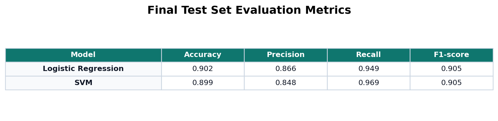
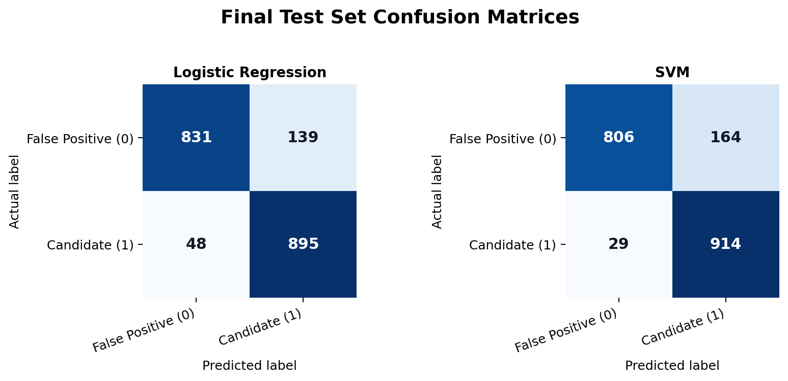

# Kepler Exoplanet Candidate Classification

## Machine Learning Model Report

**Project type:** End-to-end supervised machine learning classification project  
**Domain:** Astronomical object classification using Kepler/K2 mission data  
**Models used:** Logistic Regression and Support Vector Machine  
**Final selected model:** Logistic Regression  
**Main objective:** Classify Kepler objects as exoplanet candidates or false positives

## 1. Assignment Goal

The assignment uses data from the Kepler/K2 mission to classify Kepler Objects of Interest as either likely exoplanet candidates or false positives.

This is a **supervised machine learning** task because the dataset already contains labels. The model learns from examples where the correct class is known.

It is a **classification** task because the output is a category, not a continuous number.

The final target used in the notebook is:

```text
KeplerDispositionStatus
0 = FALSE POSITIVE
1 = CANDIDATE
```

So the final problem is **binary classification**.

## 2. Dataset Overview

The dataset contains:

```text
9564 rows
49 original columns
```

Each row represents a Kepler object. The columns describe properties such as orbital period, transit duration, planet radius, stellar temperature, and disposition labels.

The notebook first loads the dataset using:

```python
pd.read_csv("exoplanet_dataset.csv")
```

Then it checks:

- shape of the dataset
- first rows with `head()`
- data types and non-null values with `info()`
- summary statistics with `describe(include="all").T`

`describe(include="all").T` gives a feature-by-feature overview. For numeric columns it shows mean, standard deviation, min, quartiles, and max. For categorical columns it shows count, unique values, most common value, and frequency.

## 3. Column Renaming

The notebook renames the original technical column names into more descriptive names.

Example:

```text
koi_period -> OrbitalPeriod, days
koi_prad -> PlanetaryRadius, Earthradii
koi_disposition -> ExoplanetArchiveDisposition
```

This does not change the data. It only makes the notebook easier to read and explain.

## 4. Duplicate Check

The notebook checks for duplicate rows using:

```python
exoplanet_df.duplicated().sum()
```

This is part of data cleaning. Duplicate rows can bias a model because the same example may appear more than once.

## 5. Removing Unusable And Irrelevant Columns

Two columns had 100% missing values:

```text
EquilibriumTemperatureUpperUnc, K
EquilibriumTemperatureLowerUnc, K
```

These were removed because they contain no useful information.

The notebook also removes identifier/name columns:

```text
KepID
KOIName
KeplerName
TCEDeliver
```

These columns identify objects or data versions. They are not useful physical patterns for general prediction. Keeping them could make the model memorize object identities instead of learning general relationships.

## 6. Encoding Target Labels

The original target labels are text values such as:

```text
FALSE POSITIVE
CANDIDATE
CONFIRMED
```

Machine learning models need numerical input, so the notebook maps them:

```python
status_map = {
    "FALSE POSITIVE": 0,
    "CANDIDATE": 1,
    "CONFIRMED": 2
}
```

Two numeric columns are created:

```text
KeplerDispositionStatus
ArchiveDispositionStatus
```

The final model uses `KeplerDispositionStatus` as the target.

Class distribution for `KeplerDispositionStatus`:

```text
0 = 4847
1 = 4717
```

This is almost balanced, which is good for training and evaluation.

`ArchiveDispositionStatus` contains three classes:

```text
0 = 4839
1 = 2054
2 = 2671
```

However, the final model is binary because `KeplerDispositionStatus` contains only false positive and candidate.

## 7. Outlier Analysis

The notebook checks outliers using the **IQR method**.

An outlier is a value that is unusually far away from the rest of the data.

IQR means **Interquartile Range**:

```text
IQR = Q3 - Q1
```

The normal range is defined as:

```text
lower bound = Q1 - 1.5 * IQR
upper bound = Q3 + 1.5 * IQR
```

Values outside this range are counted as possible outliers.

This matters because extreme values can affect scaling and models such as Logistic Regression and SVM.

Decision:

The notebook does not automatically remove outliers. This is reasonable because in astronomy, extreme values may be real scientific observations, not data errors.

## 8. Missing Values And Imputation

Instead of removing all rows with missing values, the notebook uses median imputation:

```python
imputer = SimpleImputer(strategy="median")
clean_exoplanet[numeric_features_cols] = imputer.fit_transform(clean_exoplanet[numeric_features_cols])
```

An **imputer** fills missing values.

`strategy="median"` means missing values are replaced with the median of each numeric column.

Median is used because it is less affected by outliers than the mean.

Important definitions:

- `fit`: learn values from data, for example medians.
- `transform`: apply learned values to replace missing values.
- `fit_transform`: learn and apply in one step.

Important limitation:

In the notebook, imputation is done before the train/validation/test split. Ideally, imputation should be inside a `Pipeline` and fitted only on the training data to avoid data leakage.

## 9. Correlation Analysis

The notebook creates a correlation matrix using only numeric features.

Target-related columns are excluded:

```text
DispositionScore
KeplerDispositionStatus
ArchiveDispositionStatus
```

Correlation measures how strongly two numerical features move together.

```text
Correlation close to 1  = strong positive relationship
Correlation close to -1 = strong negative relationship
Correlation close to 0  = weak/no linear relationship
```

Highly correlated features can cause **multicollinearity**.

Multicollinearity means two or more input features contain almost the same information. This can make Logistic Regression coefficients harder to interpret.

The notebook found these highly correlated pairs:

```text
PlanetaryRadius, Earthradii
PlanetaryRadiusLowerUnc, Earthradii
correlation = 0.988

InsolationFlux, Earthflux
InsolationFluxLowerUnc, Earthflux
correlation = 0.967
```

The notebook drops:

```text
PlanetaryRadiusLowerUnc, Earthradii
InsolationFluxLowerUnc, Earthflux
```

This reduces redundant information.

Important limitation:

Correlation filtering was also done before splitting. Ideally, feature selection decisions should be based only on the training data.

## 10. Feature And Target Preparation

The final target is:

```python
y = exoplanet_model["KeplerDispositionStatus"]
```

The feature matrix `X` excludes:

```text
DispositionScore
KeplerDispositionStatus
ArchiveDispositionStatus
```

`DispositionScore` and `ArchiveDispositionStatus` are excluded because they are strongly target-related and could cause leakage.

Final shapes:

```text
X shape = (9564, 38)
y shape = (9564,)
```

Target distribution:

```text
0 = 4847
1 = 4717
```

## 11. Train, Validation, Test Split

The notebook uses a train/validation/test split.

First:

```python
X_train_val, X_test, y_train_val, y_test = train_test_split(...)
```

This keeps 20% of the data as the final test set.

Then:

```python
X_train, X_val, y_train, y_val = train_test_split(...)
```

This creates a validation set from the training data.

Final split sizes:

```text
X_train = 6120 rows
X_val   = 1531 rows
X_test  = 1913 rows
```

The split uses:

```python
stratify=y
```

Stratification keeps the class distribution similar across train, validation, and test sets.

Class proportions:

```text
Train:      0 = 50.67%, 1 = 49.33%
Validation: 0 = 50.69%, 1 = 49.31%
Test:       0 = 50.71%, 1 = 49.29%
```

This is good because all splits are representative.

## 12. Scaling

The notebook uses:

```python
scaler = StandardScaler()
X_train_scaled = scaler.fit_transform(X_train)
X_val_scaled = scaler.transform(X_val)
X_test_scaled = scaler.transform(X_test)
```

`StandardScaler` standardizes features so they have:

```text
mean = 0
standard deviation = 1
```

Formula:

```text
z = (x - mean) / standard deviation
```

Scaling is important because Logistic Regression and SVM are sensitive to feature scale.

Correct workflow:

- fit scaler on training data only
- transform validation and test data using the same scaler

This part is done correctly in the notebook.

Important definitions:

- `fit_transform(X_train)`: learn mean/std from training data and scale training data.
- `transform(X_val)`: use training mean/std to scale validation data.
- `transform(X_test)`: use training mean/std to scale test data.

Using `fit_transform` on validation or test data would be data leakage.

## 13. Logistic Regression

### Definition

Logistic Regression is a supervised classification algorithm. It predicts the probability that a row belongs to class 1.

In this notebook:

```text
class 1 = CANDIDATE
class 0 = FALSE POSITIVE
```

Even though it is called regression, it is used for classification.

### How It Works

Logistic Regression combines features using learned weights:

```text
z = w1*x1 + w2*x2 + ... + b
```

Then it passes `z` through the sigmoid function:

```text
sigmoid(z) = 1 / (1 + e^-z)
```

The sigmoid converts any number into a probability between 0 and 1.

Usually:

```text
probability >= 0.5 -> predict class 1
probability < 0.5  -> predict class 0
```

### Why Logistic Regression Was Used

It was chosen because:

- it is suitable for binary classification
- it is fast
- it is simple to explain
- it is more interpretable than many complex models

### Hyperparameter Tuning

The notebook tunes `C`:

```python
for C in [0.001, 0.01, 0.1, 1, 10, 100]:
```

`C` controls regularization.

```text
small C = stronger regularization = simpler model
large C = weaker regularization = model fits training data more strongly
```

Regularization helps reduce overfitting.

Best Logistic Regression hyperparameter:

```text
C = 0.1
```

Validation performance for best Logistic Regression:

```text
validation accuracy = 0.994
validation F1       = 0.994
```

## 14. SVM

### Definition

SVM means **Support Vector Machine**. It is a supervised classification algorithm.

### How It Works

SVM tries to find the best decision boundary between classes.

The best boundary is the one with the largest margin.

The **margin** is the distance between the boundary and the closest data points.

The closest points are called **support vectors**. They are important because they define the boundary.

### Why SVM Was Used

It was chosen because:

- it is strong for classification
- it works well with scaled numerical data
- it can use kernels for linear and nonlinear decision boundaries

### Hyperparameters

The notebook tunes:

```text
C
kernel
```

`C` controls the trade-off between margin size and classification mistakes.

```text
small C = wider margin, allows more mistakes
large C = fewer training mistakes, more risk of overfitting
```

The kernel controls the shape of the decision boundary:

```text
linear = straight boundary
rbf    = nonlinear/curved boundary
```

The notebook tests:

```python
C in [0.01, 0.1, 1, 10]
kernel in ["linear", "rbf"]
```

Best SVM hyperparameters:

```text
C = 0.01
kernel = linear
```

Validation performance for best SVM:

```text
validation accuracy = 0.993
validation F1       = 0.993
```

## 15. Evaluation Metrics

The notebook uses:

```text
accuracy
precision
recall
F1-score
confusion matrix
```

### Accuracy

Accuracy means:

```text
correct predictions / all predictions
```

It tells how often the model is correct overall.

### Precision

Precision means:

```text
of everything predicted as CANDIDATE, how many were actually CANDIDATE?
```

Low precision means many false alarms.

### Recall

Recall means:

```text
of all actual CANDIDATES, how many did the model find?
```

Low recall means the model misses possible exoplanet candidates.

### F1-Score

F1-score is the balance between precision and recall.

It is useful when both false positives and false negatives matter.

### Confusion Matrix

For this assignment:

```text
True Negative  = predicted FALSE POSITIVE and actually FALSE POSITIVE
False Positive = predicted CANDIDATE but actually FALSE POSITIVE
False Negative = predicted FALSE POSITIVE but actually CANDIDATE
True Positive  = predicted CANDIDATE and actually CANDIDATE
```

In this domain:

- false negatives are missed possible exoplanets
- false positives can waste follow-up resources

## 16. Final Model Evaluation

Final models are trained on the combined training and validation data:

```text
X_train_val
```

Then they are evaluated on the final test set.

### Evaluation Metrics Snapshot



### Confusion Matrix Snapshot



### Logistic Regression Test Results

```text
Accuracy  = 0.902
Precision = 0.866
Recall    = 0.949
F1-score  = 0.905
```

### SVM Test Results

```text
Accuracy  = 0.899
Precision = 0.848
Recall    = 0.969
F1-score  = 0.905
```

## 17. Interpretation

Both models performed extremely well on validation data, but performance dropped on the test set.

This suggests that the validation scores were optimistic, and the test set gives a more realistic estimate of generalization.

Logistic Regression had slightly better accuracy and F1-score.

SVM had higher recall, meaning it missed fewer candidates, but it also had lower precision, meaning it produced more false positives.

Final decision:

```text
Logistic Regression was selected as the final model.
```

Reason:

- slightly better overall balance
- simpler
- easier to explain and interpret

However, SVM could also be justified if the main goal is to minimize missed candidate exoplanets.

## 18. Important Limitations

### 1. Preprocessing Leakage

Imputation and correlation filtering were done before the train/validation/test split.

This can leak information from validation/test data into training.

Better solution:

Use a `Pipeline`, for example:

```python
Pipeline([
    ("imputer", SimpleImputer(strategy="median")),
    ("scaler", StandardScaler()),
    ("model", LogisticRegression(C=0.1, max_iter=5000, random_state=42))
])
```

### 2. Target-Proxy Features

Some false-positive flag features are strongly related to how the target label was created.

Examples:

```text
NotTransit-LikeFalsePositiveFlag
koi_fpflag_ss
CentroidOffsetFalsePositiveFlag
EphemerisMatchIndicatesContaminationFalsePositiveFlag
```

These may make the model learn the disposition rules instead of only physical exoplanet patterns.

This is why the high performance should be interpreted carefully.

### 3. Test Set Is Most Reliable

Because the validation performance was much higher than the test performance, the final test results should be considered the best estimate of real generalization.

## 19. Project Summary

This assignment follows the full machine learning workflow. I loaded and explored the Kepler exoplanet dataset, cleaned unusable and irrelevant columns, encoded categorical target labels, checked outliers, handled missing values with median imputation, examined correlations, split the data into training, validation, and test sets, scaled the features, trained Logistic Regression and SVM models, tuned their hyperparameters, and evaluated them using classification metrics.

The task is supervised binary classification because the dataset has known labels and the final target has two classes: false positive and candidate.

Logistic Regression was selected as the final model because it achieved slightly better overall test performance and is easier to interpret. SVM achieved higher recall, so it could be useful if the priority is to avoid missing possible exoplanet candidates.

The main thing to defend is data leakage and proxy features. Scaling was handled correctly after splitting, but imputation and correlation filtering should ideally be inside a pipeline. Also, the false-positive flag features may be strongly related to the target labels, so the model may partly learn the labeling process rather than only astrophysical relationships.

Final one-sentence conclusion:

```text
The model can classify Kepler candidates and false positives reasonably well, but the workflow should be improved with a proper pipeline and careful treatment of target-related flag features.
```
