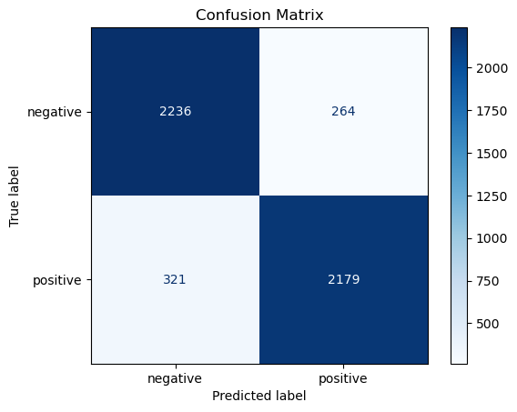
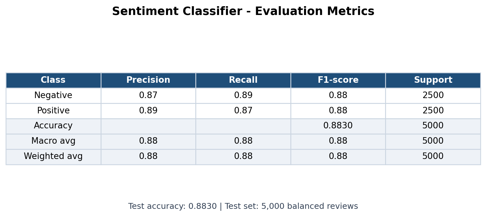
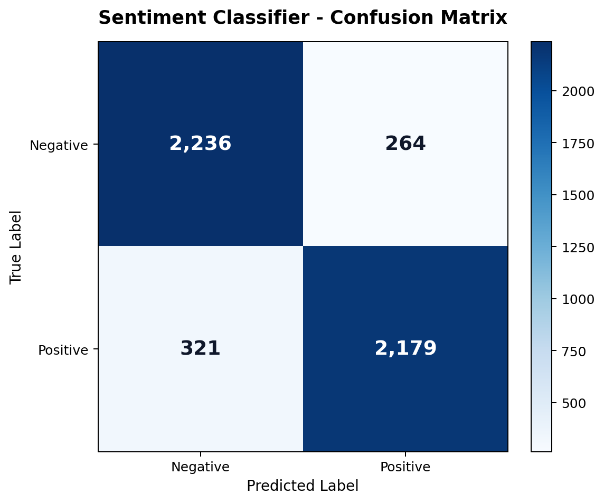

# IMDb Sentiment Classification Using a Neural Network

## Project Summary

This project builds a supervised machine learning model that classifies IMDb movie reviews as **positive** or **negative**. The solution uses Bag-of-Words text encoding and a one-hidden-layer neural network classifier. The final model achieved **88.3% test accuracy** on 5,000 unseen reviews.

**Techniques used:** supervised learning, binary classification, text preprocessing, Bag-of-Words, neural networks, hyperparameter tuning, validation testing, confusion matrix analysis.

**Tools used:** Python, pandas, NumPy, scikit-learn, Matplotlib.

## 1. Assignment Overview

The assignment is about **sentiment analysis** on IMDb movie reviews.

The goal is to build a machine learning model that can classify each review as either:

- `negative`
- `positive`

This is a **supervised binary classification** problem.

It is **supervised** because the dataset already contains the correct labels for each review. The model learns from examples where the input review and the correct output label are known.

It is **binary classification** because there are only two possible classes: negative and positive.

The final solution uses:

- `pandas` and `numpy` for loading and preparing data
- `train_test_split` for creating training, validation, and test sets
- `CountVectorizer` for Bag-of-Words text encoding
- `MLPClassifier` for the neural network classifier
- accuracy, confusion matrix, precision, recall, and F1-score for evaluation

## 2. Data Loading

The notebook loads two files:

- `reviews.txt`: contains the IMDb review texts
- `labels.txt`: contains the sentiment labels

The reviews are the **features**, also called `X`.

The labels are the **target**, also called `y`.

The original labels are text:

- `positive`
- `negative`

They are converted into binary numerical labels:

- `positive` -> `1`
- `negative` -> `0`

This is necessary because machine learning models work with numerical target values.

## 3. Data Splitting

The data is split into three parts:

- training set
- validation set
- test set

The first split separates the test set:

- 80% training + validation data
- 20% test data

The second split separates training and validation:

- 16,000 training reviews
- 4,000 validation reviews
- 5,000 test reviews

The training set is used to train the model.

The validation set is used to compare hyperparameter settings and choose the best model.

The test set is used only at the end for final evaluation.

This is important because the test set should represent unseen data.

### Important Parameters

`test_size=0.2`

Means 20% of the data is used for the second output of the split.

`random_state=0`

Makes the split reproducible. The exact number is arbitrary; using `42` would also work. The important thing is that the same number gives the same split every time.

`stratify=labels_series`

Keeps the balance between positive and negative labels in the split.

This is important because the model should train and test on representative data.

## 4. Bag-of-Words Encoding

Text cannot be used directly by most machine learning models, so the reviews must be converted into numbers.

The notebook uses:

```python
CountVectorizer(max_features=10000)
```

This creates a **Bag-of-Words** representation.

Bag-of-Words means:

- each word becomes a feature/column
- each review becomes a vector
- each value in the vector is the count of a word in that review

`max_features=10000` means only the 10,000 most frequent words are kept.

This was required by the assignment.

### Fit and Transform

`fit`

Learns from the data. For `CountVectorizer`, this means learning the vocabulary.

`transform`

Applies the learned vocabulary and converts reviews into word-count vectors.

`fit_transform`

Does both steps at once: learns the vocabulary and converts the text into vectors.

### Avoiding Data Leakage

The vectorizer is fitted only on the training data at first:

```python
X_train = vectorizer.fit_transform(X_train_reviews)
```

The validation and test sets are only transformed:

```python
X_val = vectorizer.transform(X_val_reviews)
X_test = vectorizer.transform(X_test_reviews)
```

This avoids **data leakage**.

Data leakage means using information from validation or test data during training. That would make the evaluation unfair.

## 5. Exploring the Bag-of-Words Representation

The notebook checks how the word `movie` is represented.

In Bag-of-Words, each word has a fixed index.

For example:

```text
The word 'movie' is represented by feature index 5848.
```

This means the word `movie` corresponds to one specific column in the vector.

The notebook also checks how many times `movie` appears in the first training review:

```text
Count of 'movie' in the first training review: 5
```

A whole review is represented as a 10,000-dimensional vector.

The first training review had:

```text
253 non-zero entries
```

This means only 253 of the 10,000 vocabulary words appear in that review.

The vector is therefore **sparse**, meaning most values are zero.

## 6. Neural Network Model

The notebook uses:

```python
MLPClassifier
```

`MLPClassifier` means **Multi-Layer Perceptron Classifier**.

It is a feed-forward neural network model from scikit-learn.

The assignment specifically required a neural network with a single hidden layer, so `MLPClassifier` is a suitable choice.

### What Is a Neural Network?

A neural network is a model made of connected neurons arranged in layers.

In this assignment:

- the input layer receives Bag-of-Words vectors
- the hidden layer learns patterns in word counts
- the output layer predicts negative or positive sentiment

The model learns by adjusting weights during training.

## 7. Hyperparameter Tuning

The notebook trains five candidate models with different hyperparameter settings.

Hyperparameters are values chosen before training. The model does not learn them automatically.

The tested settings include:

- hidden layer size
- activation function
- regularization strength
- batch size
- learning rate

### Hidden Layer Size

Examples:

```python
(32,)
(64,)
(128,)
```

These mean one hidden layer with 32, 64, or 128 neurons.

The comma shows that it is a tuple with one value.

One hidden layer is used because the assignment asked for a single hidden layer.

Smaller layers are simpler and may reduce overfitting.

Larger layers can learn more complex patterns but may overfit.

### Activation Function

The notebook tests:

- `relu`
- `tanh`

An activation function introduces non-linearity.

This helps the neural network learn more complex patterns.

`relu` keeps positive values and turns negative values into zero.

`tanh` maps values between -1 and 1.

### Alpha

`alpha` controls regularization strength.

The notebook tests:

- `1e-4`, which means `0.0001`
- `1e-3`, which means `0.001`

Regularization helps reduce overfitting by penalizing very large weights.

### Batch Size

The notebook uses:

```python
batch_size=256
```

This means the model processes 256 training examples before updating the weights.

This is a practical middle value: not too small and not too large.

### Learning Rate

The notebook uses:

```python
learning_rate_init=0.001
```

The learning rate controls how large the weight updates are during training.

If it is too high, training can become unstable.

If it is too low, training can be very slow.

`0.001` is a common starting value for the Adam optimizer.

### Adam Optimizer

The model uses:

```python
solver='adam'
```

Adam is the optimizer that updates the neural network weights.

It is commonly used because it works well for many neural network problems.

### Early Stopping

The model uses:

```python
early_stopping=True
n_iter_no_change=3
```

Early stopping stops training when the model stops improving.

This helps prevent overfitting.

`n_iter_no_change=3` means training stops if there is no improvement for 3 iterations.

## 8. Best Model

The best model is chosen using validation accuracy.

The best validation result was:

```text
Best validation accuracy: 0.8972
Best settings:
hidden_layer_sizes = (64,)
activation = tanh
alpha = 0.0001
batch_size = 256
learning_rate_init = 0.001
```

This means the best candidate model used one hidden layer with 64 neurons and the `tanh` activation function.

The validation set is used for this choice so the test set remains untouched until the final evaluation.

## 9. Final Model Training

After choosing the best hyperparameters, the notebook trains the final model.

For the final model, the vectorizer is fitted on training + validation text:

```python
X_train_val = vectorizer_final.fit_transform(X_train_val_reviews)
```

This is allowed because validation has already been used for model selection.

The final test set is still only transformed:

```python
X_test = vectorizer_final.transform(X_test_reviews)
```

The final model is then trained on:

```python
X_train_val, y_train_val
```

This gives the final model more data to learn from before testing.

## 10. Evaluation

The final model is evaluated on the test set.

The test accuracy was:

```text
Test accuracy: 0.8830
```

This means the model correctly classified about 88.3% of unseen test reviews.

### Evaluation Screenshots

The figures below summarize the model's final performance on the unseen test set.

Notebook output:



Clean summary visuals:





### Accuracy

Accuracy means:

```text
correct predictions / all predictions
```

It gives an overall performance score.

### Confusion Matrix

The confusion matrix was:

```text
[[2236  264]
 [ 321 2179]]
```

Rows are true labels.

Columns are predicted labels.

Interpretation:

- 2236 negative reviews were correctly predicted as negative
- 264 negative reviews were wrongly predicted as positive
- 321 positive reviews were wrongly predicted as negative
- 2179 positive reviews were correctly predicted as positive

The diagonal values are correct predictions.

The off-diagonal values are mistakes.

Most values are on the diagonal, so the model performs well.

### Precision

Precision means:

```text
Of the reviews predicted as a class, how many were correct?
```

For example, positive precision asks:

```text
Of all reviews predicted positive, how many were actually positive?
```

### Recall

Recall means:

```text
Of the actual examples in a class, how many did the model find?
```

For example, positive recall asks:

```text
Of all truly positive reviews, how many were predicted positive?
```

### F1-Score

F1-score combines precision and recall into one balanced score.

It is useful when we want a single metric that considers both false positives and false negatives.

### Support

Support means the number of real examples in each class.

The test set had:

- 2500 negative reviews
- 2500 positive reviews

This means the test set is balanced.

## 11. Testing Custom Sentences

The notebook also tests the final model on custom sentences.

Examples:

```text
An excellent and touching movie with brilliant performances.
This was a boring waste of time with terrible acting.
```

The custom sentences are transformed using the final vectorizer:

```python
X_custom = vectorizer_final.transform(my_sentences)
```

Then the model predicts the sentiment:

```python
custom_predictions = final_model.predict(X_custom)
```

The model also gives the positive probability:

```python
custom_probabilities = final_model.predict_proba(X_custom)[:, 1]
```

The predictions make sense:

- clearly positive sentences are predicted as positive
- clearly negative sentences are predicted as negative

## 12. Limitations

The model performs well, but it has limitations.

Bag-of-Words only counts words.

It does not understand:

- word order
- sarcasm
- deeper context
- negation very well

For example, the phrases `not good` and `good` can be difficult because Bag-of-Words mainly sees word counts.

## 13. Possible Alternatives

Other models could also be used for sentiment classification, such as:

- Logistic Regression
- Naive Bayes
- Support Vector Machine
- Keras or TensorFlow neural network

However, this assignment specifically asked for a neural network with a single hidden layer, so `MLPClassifier` was appropriate.

## 14. Final Exam Summary

This assignment solves IMDb sentiment analysis as a supervised binary classification problem.

The reviews are the input features, and the positive/negative labels are the target.

Since text cannot be used directly by the model, the reviews are converted into Bag-of-Words vectors using `CountVectorizer` with the 10,000 most frequent words.

The data is split into training, validation, and test sets. The validation set is used for hyperparameter tuning, and the test set is used only for final evaluation.

Several one-hidden-layer neural networks are trained with different hyperparameters. The best model uses 64 hidden neurons, `tanh` activation, and regularization strength `0.0001`.

The final model achieves about 88% accuracy on the test set. The confusion matrix and classification report show that the model performs well and has balanced results for both positive and negative reviews.

The main limitation is that Bag-of-Words counts words but does not understand word order or deeper meaning.
