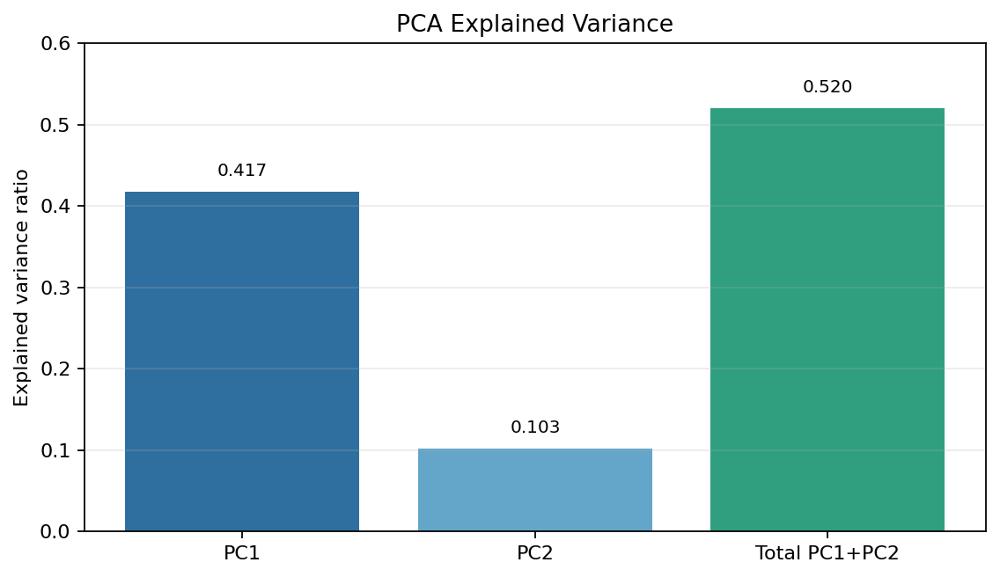
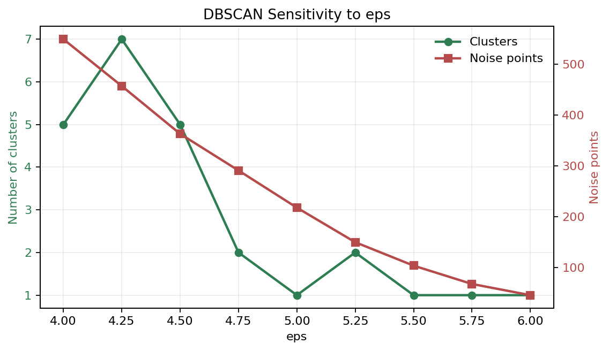
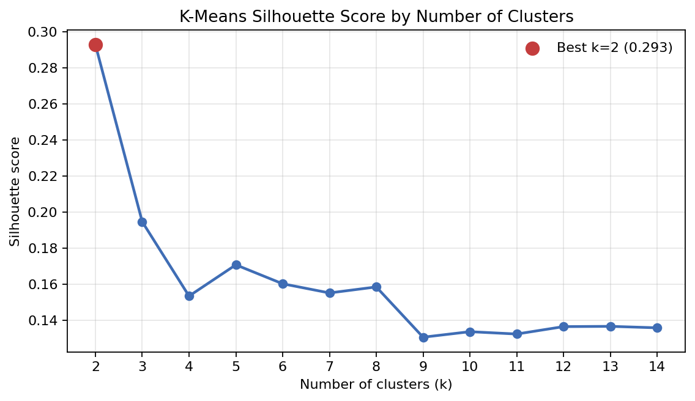

# Assignment 6: Candidate Test 2022 Part 2 - Model Notes

## 1. Assignment Goal

This assignment analyzes Danish political candidate-test answers from DR and TV2. The answers are given on a scale from `-2` to `2`, where negative values mean disagreement, `0` means neutral, and positive values mean agreement.

The goal is to understand the political landscape of candidates and parties:

- Which questions define the main political axes?
- How are parties positioned on important questions?
- Do candidates naturally form clusters?
- Do clusters correspond to parties or broader political blocs?
- How do elected candidates compare?
- Which elected candidates agree or disagree the most?
- Which parties have strong internal disagreement?

This is an **unsupervised machine learning** assignment because there is no target variable to predict. The purpose is exploration, dimensionality reduction, clustering, and interpretation.

The main methods used are:

- **PCA** for dimensionality reduction and political mapping.
- **K-Means** for centroid-based clustering.
- **Hierarchical clustering** for party similarity trees.
- **DBSCAN** for density-based clustering and noise detection.
- **Euclidean distance** for agreement/disagreement between elected candidates.

---

## 2. Data Used

The notebook uses these datasets:

| File | Purpose |
|---|---|
| `alldata.xlsx` | All candidate answers from DR and TV2 |
| `electeddata.xlsx` | Answers from candidates elected to parliament |
| `drq.xlsx` | DR question metadata |
| `tv2q.xlsx` | TV2 question metadata |

The response columns are the actual machine learning features. Metadata columns such as name, party, electoral district, and age are not used as model features.

```python
meta_cols = ["navn", "parti", "storkreds", "alder"]
feature_cols = [col for col in final_clean_data.columns if col not in meta_cols]
```

`feature_cols` contains the political answer columns used for PCA and clustering.

---

## 3. Data Cleaning and Feature Preparation

The dataset is already mostly clean. The main cleaning step is replacing age values of `0` with missing values:

```python
final_clean_data["alder"] = final_clean_data["alder"].replace(0, np.nan)
elected_clean_data["alder"] = elected_clean_data["alder"].replace(0, np.nan)
```

This is done because an age of `0` is not realistic and should not be treated as a true value.

The answer data is separated from metadata:

```python
X_all = final_clean_data[feature_cols]
X_elected = elected_clean_data[feature_cols]
```

- `X_all` is used to train PCA and clustering on all candidates.
- `X_elected` is later projected into the same PCA space.

---

## 4. Question Mapping

The original response columns are technical question IDs. To interpret the PCA axes, the notebook maps question IDs to real question text from DR and TV2.

The notebook creates:

```python
question_map
```

This contains:

- `feature`: question ID / feature name
- `source`: DR or TV2
- `topic`: short topic/title
- `question`: full question text

This is important because PCA loadings are only useful if we can connect them back to actual political questions.

Exam explanation:

> I created a question map so that PCA loadings could be interpreted politically. Instead of only seeing that feature 123 is important, I can see the actual question text and explain what political issue drives the axis.

---

## 5. Preprocessing: StandardScaler

Before PCA and clustering, the notebook standardizes the answer columns:

```python
scaler = StandardScaler()
X_all_scaled = scaler.fit_transform(X_all)
```

### What StandardScaler Does

`StandardScaler` changes each feature so it has:

- mean `0`
- standard deviation `1`

Formula:

```text
scaled value = (value - mean) / standard deviation
```

### Why Scaling Is Needed

The answers are already on the same `-2` to `2` scale, but different questions can still have different variance. For example, one question may divide candidates strongly, while another question may have mostly similar answers.

PCA and clustering are sensitive to variance and distance. Scaling makes sure each question has fair influence.

### fit_transform

```python
scaler.fit_transform(X_all)
```

means:

- `fit`: learn the mean and standard deviation from `X_all`
- `transform`: apply the scaling

For elected candidates, the notebook later uses:

```python
scaler.transform(X_elected)
```

It does not use `fit_transform` again, because elected candidates must be placed into the same scale as all candidates.

Exam explanation:

> I used StandardScaler because PCA and clustering depend on variance and distance. Scaling gives each question equal weight. I used fit_transform on all candidates to learn the scaling, and transform on elected candidates so they stay comparable to the original PCA model.

---

## 6. PCA: Principal Component Analysis

The notebook uses PCA to reduce many answer columns into two main axes:

```python
pca = PCA(n_components=2)
pca_result = pca.fit_transform(X_all_scaled)
```

### What PCA Is

PCA is an unsupervised dimensionality reduction algorithm. It finds new axes called **principal components**.

These axes summarize the strongest patterns in the data.

- `PC1`: direction with the most variance
- `PC2`: second strongest direction, independent from PC1

In simple words:

> PCA finds the best viewing angle of the data. PC1 is the direction where candidates are most spread out. PC2 is the next best direction at a right angle to PC1.

### Mathematical Idea

PCA works roughly in these steps:

1. Start with the candidate-answer matrix.
2. Standardize the features.
3. Calculate how features vary together, using covariance/correlation.
4. Find eigenvectors and eigenvalues.
5. Select the most important components.
6. Project the data onto those components.

In PCA:

- **Eigenvectors** are the principal component directions.
- **Eigenvalues** tell how much variance each direction explains.

### n_components

```python
PCA(n_components=2)
```

`n_components=2` means we keep only two principal components. This is chosen because the goal is to create a two-dimensional political map.

### Explained Variance

The notebook prints:

```python
pca.explained_variance_ratio_
```

Example result:

```text
PC1 = 0.417
PC2 = 0.103
Total = 0.52
```



Interpretation:

- PC1 explains 41.7% of the differences in candidate answers.
- PC2 explains 10.3%.
- Together, the 2D PCA plot explains 52% of the total variation.

This means the PCA plot is useful, but still a simplification. The remaining 48% is in later components that are not shown.

Exam explanation:

> PCA reduced the many political answer columns into two axes. PC1 captures the strongest pattern in how candidates differ, and PC2 captures the second strongest independent pattern. The first two components explained about 52% of the total variation, so the map gives a meaningful but simplified political landscape.

---

## 7. PCA Political Landscape Plot

The notebook creates a scatterplot:

```python
sns.scatterplot(
    data=pca_data,
    x="PC1",
    y="PC2",
    hue="parti",
    palette=party_colors
)
```

### How To Read the Plot

- Each point is one candidate.
- Color represents party.
- Candidates close together gave similar answers.
- Candidates far apart gave different answers.
- PC1 is the strongest answer pattern.
- PC2 is the second strongest answer pattern.

The PCA plot is called a **political landscape** because it maps candidates according to their political answer patterns.

Exam explanation:

> The PCA plot shows candidates in a two-dimensional political landscape. Points close together represent candidates with similar answer patterns, while points far apart represent candidates who answered differently. The colors show party membership, so we can see whether parties form visible regions.

---

## 8. PCA Loadings

The notebook calculates loadings:

```python
loadings = pd.DataFrame(
    pca.components_.T,
    index=feature_cols,
    columns=["PC1", "PC2"]
)
```

### What Loadings Are

Loadings show how strongly each original question contributes to PC1 and PC2.

Large loading values mean a question is important for that component.

Important:

```text
size = importance
sign = direction
```

So:

- `0.32` is important.
- `-0.32` is also important.
- `0.02` is not very important.

The minus sign does not mean less important. It means the question points toward the negative side of the PCA axis.

### Why Loadings Are Used

The PCA axes are mathematical. Loadings help interpret them politically by showing which questions define each axis.

Exam explanation:

> I used PCA loadings to understand what PC1 and PC2 mean. Loadings show which original questions contribute most to each component. A large positive or negative loading is important; the sign only shows direction on the axis.

---

## 9. Most Important Questions for PC1 and PC2

The notebook selects the top questions by absolute loading:

```python
pc1_important = loadings_with_questions.reindex(
    loadings_with_questions["PC1"].abs().sort_values(ascending=False).index
).head(10)
```

The same is done for PC2.

### Why Absolute Value Is Used

`abs()` ignores the sign and focuses on strength.

For example:

```text
-0.40 and 0.40 are equally important
```

They just point in opposite directions.

Exam explanation:

> I sorted the loadings by absolute value because both positive and negative loadings can strongly define an axis. This gives the questions that matter most for interpreting PC1 and PC2.

---

## 10. Average Party Positions by Question

The notebook calculates average party responses:

```python
party_question_avg = all_data.groupby("parti")[feature_cols].mean()
```

This gives the mean answer for each party on each question.

Then the data is reshaped:

```python
party_question_avg_long = party_question_avg.reset_index().melt(...)
```

### What melt Does

`melt` converts a wide table into a long table.

Wide format:

```text
party | Q1 | Q2 | Q3
```

Long format:

```text
party | feature | average_response
```

Long format is easier for plotting with Seaborn.

Exam explanation:

> I calculated party averages for each question to see how parties differ on the questions that drive the PCA axes. The melt function reshaped the data into long format, which makes it easier to create barplots.

---

## 11. Selected Question Plots

The notebook selects the most important questions from PC1 and PC2:

```python
selected_questions = pd.concat([
    pc1_important.head(3),
    pc2_important.head(3)
])["feature"].drop_duplicates().tolist()
```

Then it plots average party responses for those questions.

### Why This Is Done

PCA loadings identify important questions, but plots make them easier to explain. The barplots show which parties agree or disagree with each important question.

The vertical line at `0` shows the neutral position:

```python
plt.axvline(0)
```

- Bars to the right mean agreement.
- Bars to the left mean disagreement.

Exam explanation:

> After identifying important PCA questions, I plotted party averages for selected questions. This helps explain the political meaning of the PCA axes by showing which parties agree or disagree with the questions driving the components.

---

## 12. K-Means Clustering

The notebook tests K-Means with different cluster numbers:

```python
k_values = range(2, 15)
```

### What K-Means Is

K-Means is an unsupervised clustering algorithm. It groups data points based on similarity.

It works like this:

1. Choose the number of clusters, `k`.
2. Place cluster centers.
3. Assign each point to the nearest center.
4. Move each center to the average of assigned points.
5. Repeat until stable.

### Hyperparameters

```python
KMeans(n_clusters=k, random_state=42, n_init=10)
```

| Hyperparameter | Meaning |
|---|---|
| `n_clusters` | Number of clusters to create |
| `random_state=42` | Makes results reproducible |
| `n_init=10` | Runs K-Means 10 times with different starts and keeps the best |

### Why k From 2 to 14

The assignment asks whether clusters could correspond to parties. Since there are many parties, the notebook tests different values of `k`.

Exam explanation:

> I used K-Means to group candidates by answer similarity. Since K-Means requires choosing the number of clusters, I tested k from 2 to 14 to see whether the data naturally forms broad groups or party-level clusters.

---

## 13. K-Means Evaluation: Silhouette Score

The notebook evaluates K-Means using:

```python
silhouette_score(X_all_scaled, cluster_labels)
```

### What Silhouette Score Measures

Silhouette score checks:

- Are points close to their own cluster?
- Are points far from other clusters?

Interpretation:

| Score | Meaning |
|---|---|
| close to 1 | strong, clear clusters |
| around 0 | overlapping clusters |
| below 0 | bad clustering |

The best result in the notebook is:

```text
k = 2, silhouette score around 0.293
```

This means the clearest K-Means structure is two broad groups.

Because the score is only moderate, the groups are visible but not perfectly separated.

Exam explanation:

> I used silhouette score to choose the best number of clusters. The highest score was for k=2, which suggests that the strongest structure is two broad political blocs rather than separate clusters for every party. The score is moderate, so the split is not perfect.

---

## 14. K-Means Cluster Interpretation

After selecting `k=2`, the notebook fits K-Means:

```python
kmeans = KMeans(n_clusters=2, random_state=42, n_init=10)
pca_data["kmeans_cluster"] = kmeans.fit_predict(X_all_scaled)
```

The clustering is done on `X_all_scaled`, not only the PCA plot. This means K-Means uses all political question answers.

The notebook then creates a crosstab:

```python
pd.crosstab(
    pca_data["kmeans_cluster"],
    pca_data["parti"],
    normalize="index"
)
```

This shows the party composition of each cluster.

Exam explanation:

> After choosing k=2, I assigned each candidate to one of two clusters using all scaled answer features. I then used a normalized crosstab to see which parties appear in each cluster. This helps interpret whether the clusters correspond to political blocs.

---

## 15. K-Means With 5 Clusters

The notebook also tests:

```python
chosen_k = 5
```

Even though `k=2` had the best silhouette score, `k=5` is useful as an exploratory alternative.

It can reveal smaller political subgroups, but because its silhouette score is lower, it is less naturally separated than `k=2`.

Exam explanation:

> I also tested k=5 to see whether a more detailed structure appears. It gives more political detail, but since the silhouette score is lower than k=2, it is less clearly supported by the data.

---

## 16. Hierarchical Clustering

The notebook groups parties by average answer profile:

```python
party_profiles = all_data.groupby("parti")[feature_cols].mean()
```

Then it performs hierarchical clustering:

```python
linked = linkage(party_profiles, method="ward")
```

### What Hierarchical Clustering Is

Hierarchical clustering builds a tree of similarity.

It starts with each party as its own cluster, then repeatedly merges the most similar parties until all parties are connected.

The tree is called a **dendrogram**.

### Ward Linkage

`method="ward"` means the algorithm merges groups in a way that keeps clusters compact. It tries to minimize the increase in within-cluster variance.

### How To Read a Dendrogram

- Parties merging low are similar.
- Parties merging high are different.
- Large vertical distance means stronger separation.

Exam explanation:

> I used hierarchical clustering on party average responses to see which parties are most similar. The dendrogram shows that parties merging at low distances have similar answer profiles, while parties merging high are more different. This supports the broad bloc structure found by PCA and K-Means.

---

## 17. DBSCAN Clustering

The notebook tests DBSCAN with multiple `eps` values:

```python
dbscan = DBSCAN(eps=eps, min_samples=5)
labels = dbscan.fit_predict(X_all_scaled)
```

### What DBSCAN Is

DBSCAN is a density-based clustering algorithm.

It finds dense regions of points and labels isolated points as noise.

Unlike K-Means, DBSCAN does not require choosing the number of clusters first.

### Hyperparameters

| Hyperparameter | Meaning |
|---|---|
| `eps` | Neighborhood radius |
| `min_samples` | Minimum number of nearby points needed to form a dense region |

Small `eps`:

- stricter
- more noise points
- more small clusters

Large `eps`:

- looser
- fewer noise points
- clusters may merge

Noise points are labeled:

```text
-1
```

The notebook counts:

```python
n_clusters = len(set(labels)) - (1 if -1 in labels else 0)
n_noise = (labels == -1).sum()
```

Exam explanation:

> I used DBSCAN to test whether the candidates form density-based clusters. I varied eps because DBSCAN is very sensitive to neighborhood size. Small eps values produce many noise points, while large eps values can merge many candidates into one cluster.

---

## 18. DBSCAN Evaluation

DBSCAN is evaluated by looking at:

- number of clusters
- number of noise points
- stability across `eps` values

The notebook first tests rough values:

```python
eps_values = [2, 3, 4, 5, 6, 7, 8]
```

Then it zooms in:

```python
eps_values = np.arange(4.0, 6.1, 0.25)
```

This checks whether there is a stable range where DBSCAN gives meaningful clusters.

Overall, DBSCAN does not give a very stable or meaningful multi-cluster structure for this dataset.



Exam explanation:

> DBSCAN was less successful here. With small eps values, too many candidates become noise. With larger eps values, clusters merge together. So DBSCAN suggests that this dataset is not mainly structured as dense isolated clusters.

---

## 19. Elected Candidates PCA Projection

The notebook projects elected candidates into the same PCA space:

```python
X_elected_scaled = scaler.transform(X_elected)
elected_pca_result = pca.transform(X_elected_scaled)
```

### Why transform Is Used

The scaler and PCA were fitted on all candidates. For elected candidates, the notebook uses `transform`, not `fit_transform`.

This is important because elected candidates must be placed on the same political map as all candidates.

If PCA was fitted again on elected candidates, it would create a different coordinate system.

Exam explanation:

> I transformed elected candidates using the same scaler and PCA model fitted on all candidates. This means elected candidates are projected into the same political landscape, making the result comparable.

---

## 20. Elected Candidates Political Landscape

The notebook plots elected candidates:

```python
sns.scatterplot(
    data=elected_pca_data,
    x="PC1",
    y="PC2",
    hue="parti"
)
```

This shows only elected members in the PCA political landscape.

Interpretation:

- Close points mean similar answer patterns.
- Far points mean different answer patterns.
- Compact parties show internal agreement.
- Spread-out parties show internal disagreement.

Exam explanation:

> This plot shows only elected candidates in the same PCA space. It allows us to see whether elected candidates form similar party regions and whether some parties are internally more spread out than others.

---

## 21. Agreement and Disagreement: Euclidean Distance

The notebook calculates pairwise distances between elected candidates:

```python
distance_matrix = squareform(pdist(X_elected_scaled, metric="euclidean"))
```

### What Euclidean Distance Is

Euclidean distance is straight-line distance between two points.

In this assignment, each elected candidate is represented by a vector of scaled answers.

Small distance:

```text
similar answers, high agreement
```

Large distance:

```text
different answers, high disagreement
```

### pdist and squareform

```python
pdist(X_elected_scaled, metric="euclidean")
```

calculates pairwise distances.

```python
squareform(...)
```

turns the result into a square distance matrix.

The notebook then creates all unique candidate pairs and attaches candidate names and parties.

Exam explanation:

> I used Euclidean distance between scaled answer vectors to measure agreement between elected candidates. A small distance means two candidates answered similarly, while a large distance means they answered differently.

---

## 22. Most Similar and Most Different Candidates

The notebook sorts candidate pairs:

```python
most_similar = distance_pairs.sort_values("distance").head(10)
most_different = distance_pairs.sort_values("distance", ascending=False).head(10)
```

Interpretation:

- `most_similar`: pairs with the smallest distances
- `most_different`: pairs with the largest distances

Exam explanation:

> I sorted the pairwise distances to find which elected candidates agree the most and which disagree the most. This directly answers the assignment requirement about agreement and disagreement among elected members.

---

## 23. Internal Party Disagreement

The notebook calculates internal disagreement inside each party:

```python
for party, group in elected_clean_data.groupby("parti"):
    group_positions = X_elected_scaled[group.index]
    distances = pdist(group_positions, metric="euclidean")
```

For each party, it calculates all pairwise distances between elected candidates from that party.

Then it calculates the average distance:

```python
distances.mean()
```

Interpretation:

- Higher average internal distance means more disagreement inside the party.
- Lower average internal distance means the party is more internally consistent.

Exam explanation:

> I measured internal party disagreement by calculating the average pairwise distance between elected candidates within the same party. A larger mean distance means the party members answered more differently from each other.

---

## 24. Evaluation Metrics and Interpretation Summary

Because this is an **unsupervised learning** assignment, there is no accuracy, precision, recall, F1-score, confusion matrix, or test-set score. Those metrics are used for supervised prediction tasks. Here, the goal is not to predict a correct label, but to evaluate structure, similarity, dimensionality reduction, and cluster quality.

The evaluation is therefore based on:

- how much variation PCA preserves,
- which questions explain the PCA axes,
- how compact and separated K-Means clusters are,
- how parties merge in hierarchical clustering,
- how stable DBSCAN is across `eps` values,
- and how large distances are between elected candidates.

| Method | Metric / Evaluation | What It Answers |
|---|---|---|
| PCA | Explained variance ratio | How much of the answer variation is captured by PC1 and PC2? |
| PCA | Loadings | Which original questions define the PCA axes? |
| K-Means | Silhouette score | Which `k` gives the clearest clusters? |
| K-Means | Crosstab by party | Do clusters correspond to parties or broader blocs? |
| Hierarchical clustering | Dendrogram merge distance | Which parties are most similar or different? |
| DBSCAN | Number of clusters | How many density-based groups are found? |
| DBSCAN | Number of noise points | How many candidates do not belong to a dense cluster? |
| DBSCAN | Stability across `eps` | Are the DBSCAN results reliable or very sensitive? |
| Elected candidate agreement | Euclidean distance | Which elected candidates agree or disagree most? |
| Internal party disagreement | Mean pairwise distance | Which parties are most internally divided? |

### 24.1 PCA: Explained Variance Ratio

Used in:

```python
pca.explained_variance_ratio_
```

The explained variance ratio tells how much of the original answer variation is captured by each principal component.

Example:

```text
PC1 = 0.417
PC2 = 0.103
Total = 0.52
```


Interpretation:

- PC1 captures 41.7% of how candidates differ in their answers.
- PC2 captures another 10.3%.
- Together, the two-dimensional PCA map captures 52% of the total variation.

This means the PCA map is meaningful, but it is still a simplification. The remaining 48% is spread across later components that are not shown.

Exam sentence:

> I evaluated PCA using explained variance ratio. It showed how much information the first two components kept from the original answer data. Since PC1 and PC2 together explained around 52%, the 2D map is useful, but not a complete representation of all differences.

### 24.2 PCA: Loadings

Used in:

```python
pca.components_
```

Loadings show how strongly each original question contributes to PC1 and PC2.

Important rule:

```text
absolute size = importance
sign = direction
```

So:

- `0.32` and `-0.32` are equally important.
- The sign only shows opposite sides of the PCA axis.
- A value close to `0` means the question does not influence that component much.

Exam sentence:

> I used loadings to interpret the PCA axes. Large positive or negative loadings show which questions define PC1 and PC2. This is important because PCA components are mathematical axes, and loadings connect them back to real political questions.

### 24.3 K-Means: Silhouette Score

Used in:

```python
silhouette_score(X_all_scaled, cluster_labels)
```

Silhouette score is the main evaluation metric used for K-Means in this notebook. It evaluates how good a clustering result is when there are no true labels.

It checks two things:

1. How close candidates are to others in their own cluster.
2. How far candidates are from other clusters.

For one candidate, silhouette score uses:

```text
a = average distance to candidates in the same cluster
b = average distance to candidates in the nearest other cluster
silhouette score = (b - a) / max(a, b)
```

Meaning:

- If `a` is small, the candidate fits well inside its own cluster.
- If `b` is large, the candidate is far from the nearest other cluster.
- A good cluster has small `a` and large `b`.

Interpretation:

| Score Range | Meaning |
|---|---|
| close to `1` | strong, clear clusters |
| around `0` | overlapping or weak clusters |
| below `0` | candidates may be assigned to wrong clusters |

In the notebook, K-Means was tested for `k = 2` to `k = 14`:

```text
k=2   silhouette score = 0.292870
k=3   silhouette score = 0.194576
k=4   silhouette score = 0.153307
k=5   silhouette score = 0.170655
...
k=14  silhouette score = 0.135673
```



The best result was `k=2`, with a silhouette score of about `0.293`.

This means the clearest K-Means structure is two clusters. Since the score is not close to `1`, the separation is moderate, not perfect. The lower scores for larger `k` values mean that forcing the data into many clusters, such as one cluster per party, is less supported by the data.

Exam sentence:

> I evaluated K-Means using silhouette score. The best score was for k=2, around 0.293, meaning the strongest structure is two broad political groups. Since the score is moderate, the clusters are visible but not perfectly separated.

### 24.4 K-Means: Party Crosstab

Used in:

```python
pd.crosstab(
    pca_data["kmeans_cluster"],
    pca_data["parti"],
    normalize="index"
)
```

The crosstab is not a mathematical metric like silhouette score, but it is an important interpretation tool.

It answers:

> Which parties are inside each K-Means cluster?

This helps decide whether clusters represent:

- individual parties,
- broader political blocs,
- or mixed groups.

Exam sentence:

> After choosing k=2, I used a normalized crosstab to inspect party composition inside each cluster. This showed whether K-Means clusters matched political blocs or individual parties.

### 24.5 Hierarchical Clustering: Dendrogram Distance

Used in:

```python
linked = linkage(party_profiles, method="ward")
dendrogram(linked)
```

Hierarchical clustering is evaluated visually using the dendrogram.

The y-axis shows distance:

- low merge distance = parties are similar,
- high merge distance = parties are different.

With Ward linkage, the algorithm merges parties/clusters while trying to keep groups compact.

Exam sentence:

> I evaluated hierarchical clustering by reading the dendrogram. Parties that merged at low distances had similar average answer profiles, while parties merging only at high distances were more different. This supported the broad bloc structure.

### 24.6 DBSCAN: Clusters, Noise, and Stability

Used in:

```python
n_clusters = len(set(labels)) - (1 if -1 in labels else 0)
n_noise = (labels == -1).sum()
```

DBSCAN is evaluated differently from K-Means because DBSCAN does not need a chosen number of clusters.

The important outputs are:

- how many clusters it finds,
- how many candidates are labeled as noise,
- whether the result stays stable when `eps` changes.

Noise points have label:

```text
-1
```

Interpretation:

- Too many noise points means `eps` is probably too small.
- One huge cluster means `eps` is probably too large.
- If small changes in `eps` create very different results, DBSCAN is unstable for this dataset.


Exam sentence:

> I evaluated DBSCAN by checking the number of clusters and noise points for different eps values. The results were not very stable: small eps values created many noise points, while larger eps values merged candidates together. So DBSCAN was less useful for this dataset.

### 24.7 Elected Candidates: Euclidean Distance

Used in:

```python
pdist(X_elected_scaled, metric="euclidean")
```

Euclidean distance measures straight-line distance between two candidates' scaled answer vectors.

Interpretation:

- small distance = similar answers = more agreement,
- large distance = different answers = more disagreement.

This was used to find:

```python
most_similar
most_different
```

Exam sentence:

> I used Euclidean distance to measure agreement between elected candidates. Small distances mean candidates answered similarly, while large distances mean they disagreed more across the political questions.

### 24.8 Internal Party Disagreement: Mean Pairwise Distance

Used in:

```python
distances = pdist(group_positions, metric="euclidean")
mean_internal_distance = distances.mean()
```

For each party, the notebook calculates distances between all elected members of that party.

Then it takes the mean distance.

Interpretation:

- high mean internal distance = more disagreement inside the party,
- low mean internal distance = party members are more similar.

Exam sentence:

> I measured internal party disagreement using the average pairwise Euclidean distance between elected members of the same party. This shows which parties have more varied answer patterns internally.

---

## 25. Final Exam Summary

This assignment used unsupervised learning to analyze political candidate-test data. PCA reduced the answer data into a two-dimensional political landscape, where candidates close together gave similar answers. PCA loadings were used to interpret which questions shaped the main axes.

K-Means tested whether candidates naturally cluster into political groups. The best silhouette score was for `k=2`, suggesting that the strongest structure is two broad political blocs rather than one cluster per party.

Hierarchical clustering supported this by showing party similarities in a dendrogram. DBSCAN was less stable, because different `eps` values either produced too much noise or merged candidates into large clusters.

For elected candidates, the notebook projected them into the same PCA space and used Euclidean distance to find which elected members agreed or disagreed most. Internal party disagreement was measured using average pairwise distance within parties.

Overall, the analysis shows that the candidate answers are best explained by broad political blocs, with some party-level structure and some internal party disagreement.

---

## 26. Short 6-Minute Speaking Structure

Use this order in the exam:

1. **Intro**: candidate-test answers, unsupervised learning, goal is political similarity.
2. **Data and preprocessing**: answer columns, metadata removed, age zero fixed, StandardScaler used.
3. **PCA**: dimensionality reduction, PC1/PC2, explained variance, political landscape.
4. **Loadings and party averages**: interpret axes using important questions and party barplots.
5. **K-Means**: tested k from 2 to 14, silhouette score best at k=2.
6. **Hierarchical clustering**: dendrogram of party average profiles.
7. **DBSCAN**: density clustering, eps/min_samples, not very stable here.
8. **Elected candidates**: projected into same PCA space, distances for agreement/disagreement.
9. **Conclusion**: broad political blocs are stronger than separate party clusters.
